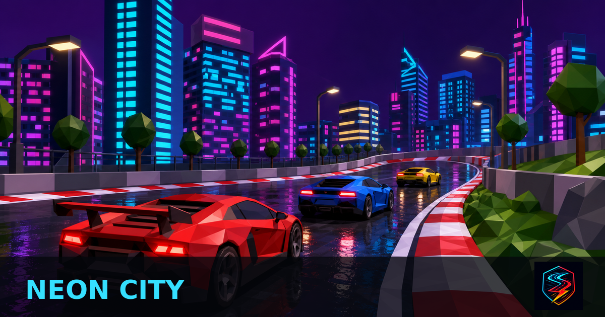
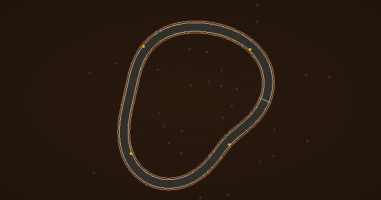
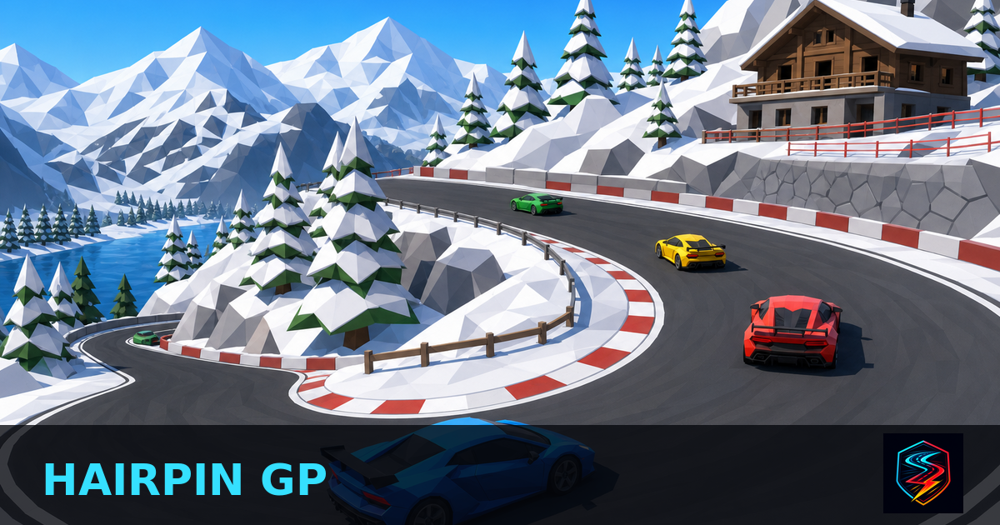
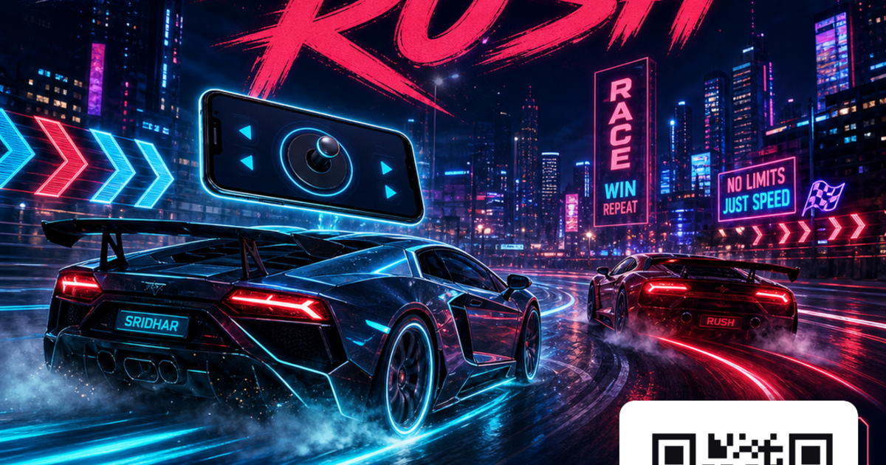
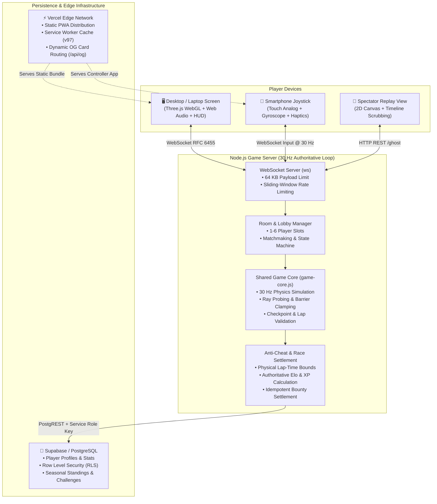

# SRIDHAR RUSH

<div align="center">


### **Browser-based real-time multiplayer 3D racing where your phone becomes the steering wheel.**

[](https://sridhar-drift.vercel.app)
[](https://github.com/yathamsridharreddy/MULTIPLAYER-CAR-GAME)

[](test/)
[](test/)
[](shared/game-core.js)
[](server.js)
[](public/js/game.js)
[](public/manifest.webmanifest)
[](public/js/i18n.js)
[](LICENSE)

*Zero downloads. Zero app store friction. Scan a QR code on your desktop screen to turn any smartphone into a wireless dual-analog gamepad with haptics and gyro steering.*

</div>

---

## 📑 Table of Contents

1. [Engineering Highlights](#-engineering-highlights)
2. [What is SRIDHAR RUSH?](#-what-is-sridhar-rush)
3. [Visual Showcase](#-visual-showcase)
4. [System Architecture](#-system-architecture)
5. [Real-Time Multiplayer Protocol](#-real-time-multiplayer-protocol)
6. [Phone-as-Controller Technology](#-phone-as-controller-technology)
7. [Server Authority & Anti-Cheat](#-server-authority--anti-cheat)
8. [Competitive Systems & Retention](#-competitive-systems--retention)
9. [Feature Matrix](#-feature-matrix)
10. [Technology Stack](#-technology-stack)
11. [Project Directory Structure](#-project-directory-structure)
12. [Local Development & Quick Start](#-local-development--quick-start)
13. [Environment Variables](#-environment-variables)
14. [Production Deployment](#-production-deployment)
15. [Automated Testing & QA](#-automated-testing--qa)
16. [Performance Optimization](#-performance-optimization)
17. [Accessibility & Ergonomics](#-accessibility--ergonomics)
18. [Internationalization (i18n)](#-internationalization-i18n)
19. [Troubleshooting](#-troubleshooting)
20. [Contributing & Security](#-contributing--security)
21. [License](#-license)

---

## ⚡ Engineering Highlights

- **30 Hz Authoritative Physics Engine**: Shared deterministic vehicle simulation (`shared/game-core.js`) running concurrently across Node.js servers and browser clients with zero desync.
- **Cross-Device Phone Joystick Pipeline**: Uses WebSockets, Touch Events, DeviceOrientation (gyroscope accelerometer), and the Web Vibration API to transform smartphones into responsive gamepads with sub-20ms input transmission.
- **Client Interpolation & Dead Reckoning**: Smooth 60 FPS rendering through an adaptive 120ms snapshot interpolation buffer with dead-reckoning extrapolation for packet jitter absorption.
- **Anti-Cheat & Authoritative Settlement**: Server-calculated lap validation against physical theoretical minimums, preventing coordinate teleportation, forged lap times, and fabricated currency awards.
- **Competitive Retention & Social Layer**: Real-time Elo rating, 4-tier milestone badges, seasonal championships, asynchronous ghost replays (`/replay`), daily UTC challenges, and Syndicate Crews with shared mileage pools.
- **High-Performance WebGL & Zero-Allocation Loops**: Custom Three.js render loop with preallocated scratch vectors, instanced mesh geometry for track foliage and barriers, and half-rate minimap execution to eliminate garbage collection pauses.
- **PWA & Offline Asset Strategy**: Dual web app manifests (`manifest.webmanifest` and `manifest-controller.webmanifest`) with versioned Service Worker caching (`sridhar-rush-v97`) for instant repeat visits.

---

## 🏎️ What is SRIDHAR RUSH?

**SRIDHAR RUSH** is an arcade-style 3D multiplayer racing game designed for instant web play. It bridges the gap between desktop screens and mobile hardware:

1. **Desktop / Laptop View**: Displays the 3D race circuit rendered in WebGL with dynamic weather, procedural engine audio, dynamic racing line splines, and live telemetry HUD.
2. **Mobile Phone View**: Acts as an untethered wireless controller displaying dual virtual thumbsticks, responsive gyro tilt steering, nitro boost trigger, drift button, and collision haptic feedback.
3. **Multiplayer Scalability**: Supports 1 to 6 players per room over WebSockets, head-to-head quickplay matchmaking, split-screen local duels, time trials against personal best ghosts, and adaptive AI bots with selectable skill levels (Rookie / Pro).

---

## 📸 Visual Showcase

<div align="center">
  
</div>

### Circuit Lineup

| Highland Rush | Neon City | Island Motorfest |
| :---: | :---: | :---: |
| <br/>**HIGHLAND RUSH**<br/>Daytime · Pine Forests & Mountain Passes | <br/>**NEON CITY**<br/>Night · Bloom-Lit Downtown Cyber Streets | <br/>**ISLAND MOTORFEST**<br/>Sunset · Ocean Coastlines & Volcano Roads |

| Canyon Chicane | Hairpin GP | Social & Open Graph Previews |
| :---: | :---: | :---: |
| <br/>**CANYON CHICANE**<br/>Desert · High-Speed S-Curves & Chicanes | <br/>**HAIRPIN GP**<br/>Snow · Alpine Hairpins & Ice Drifting | <br/>**RICH METADATA**<br/>Dynamic Open Graph Cards for Link Sharing |

> **Recommended Additional Showcase Assets**: For expanded media kits, developers can capture high-resolution in-game screenshots of:
> 1. Phone Gamepad UI (`/controller.html` in active landscape mode)
> 2. Post-Race Podium & Rating Movement Card (`#results` dialog)
> 3. Standalone Ghost Replay Spectator Theater (`/replay.html`)

---

## 🏗️ System Architecture

SRIDHAR RUSH uses a client-server topology where the browser focuses on rendering and user interaction, while the Node.js server acts as the authoritative source of truth.



---

## 🌐 Real-Time Multiplayer Protocol

### 1. Connection & Room Lifecycle
- **Room Creation**: The screen client connects via WebSocket with `{ type: 'hello', role: 'screen' }`. The server assigns a unique 5-letter room code (e.g., `ALPHA`) and returns `{ type: 'welcome', slot: 1, code: 'ALPHA' }`.
- **Matchmaking**: Players can initiate 1v1 quickplay via `{ type: 'matchmake' }`, grouping matched drivers into dedicated rooms with zero manual setup.
- **Phone Controller Pairing**: A smartphone scanning the room's QR code connects with `{ type: 'hello', role: 'controller', room: 'ALPHA', slot: 1 }`.
- **Exiting & Room Hopping** *(build v91)*: The lobby's **`🚪 EXIT ROOM`** button sends `{ type: 'leave' }`, which frees the seat, releases the slot's cached identity (uid / device pid / rating), closes the room outright when nobody is left in it, and parks the socket back in the lobby pool with `{ type: 'lobby_welcome', left: true }` — **no page reload**, so the session, garage loadout and club identity survive. `{ type: 'join_room', room: 'ALPHA' }` then hops straight into another room on the same socket, and **`➕ CREATE`** founds a fresh one after confirming the abandoned room may be dropped.
- **Safe Hop Validation**: `join_room` validates its target *before* tearing anything down. An unknown code, a full room, or the room the racer is already in returns `{ type: 'error', code: 'join-failed', reason: 'no-room' | 'full' | 'already-in-room' }` and the racer **keeps their current seat** — a typo can never eject anybody mid-race. Clients older than v91 are handled too: if the relay never confirms the move, the browser falls back to a clean reload after 1.6 s.

### 2. The 30 Hz Authoritative Simulation Loop
- Every 33.33ms ($1/30\text{s}$), the server advances the physics world:
  1. Gathers the latest inputs from all player and controller sockets.
  2. Applies vehicle acceleration, steering angle, braking force, drift drag, and nitro multipliers.
  3. Evaluates track boundary collision constraints using exact normal projections and tire stack hazards.
  4. Detects checkpoint crossings, lap increments, and race finishes.
  5. Broadcasts a compact state snapshot `{ type: 'state', cars: [...], raceTime, events: [...] }` to all connected screens.

### 3. Client Interpolation & Reconciliation
- The Three.js client maintains a circular snapshot buffer with an adaptive target delay of 120ms.
- Positions and velocities are interpolated between adjacent snapshots using spherical linear angle interpolation (`lerpAngle`) and cubic smoothing.
- If a temporary network gap occurs, the client performs local dead-reckoning extrapolation for up to 130ms, preventing visible frame stuttering.

### 4. 10-Second Auto-Rematch Loop
- Upon race completion, the server calculates placements, broadcasts finish events, and opens a 10-second rematch countdown.
- Clicking **`🔁 REMATCH`** from either the desktop screen or mobile controller queues the room for an immediate grid reset without full page reloads.

---

## 📱 Phone-as-Controller Technology

```
[ Laptop / Desktop Screen ]                 [ Smartphone ]
       │                                          │
       ├──── Displays Dynamic QR Code ───────────►│ (Camera Scan)
       │                                          │
       │                                          ├──── Opens /controller.html
       │                                          ├──── Locks Landscape Orientation
       │                                          ├──── Activates Touch Zones & Gyro
       │                                          │
       │◄─── WebSocket Input Stream (30 Hz) ──────┤ (Steer / Throttle / Nitro)
       │                                          │
       ├──── Telemetry Feedback Stream ──────────►│ (Speed / Lap / Haptic Buzz)
```

1. **Dual-Zone Analog Virtual Sticks**:
   - **Left Thumb Zone**: Controls precision steering deflection ($\pm 1.0$).
   - **Right Thumb Zone**: Vertical deflection controls progressive throttle ($0.0 \to 1.0$) and braking ($0.0 \to 1.0$).
2. **DeviceOrientation Gyroscope Steering**:
   - Tapping **`GYRO`** requests orientation permissions and binds device tilt ($\gamma$ axis) directly to steering input, letting drivers tilt their phone like a steering wheel.
3. **Web Vibration Haptic Feedback**:
   - Distinct vibration patterns trigger for the race-start GO signal (`[60ms, 40ms, 60ms]`), high-speed barrier collisions (`70ms`), nitro ignition (`18ms`), and checkered flag finishes (`[120ms, 60ms, 120ms]`).
4. **Resilient Reconnection**:
   - If the mobile browser enters the background, inputs zero out automatically. Upon returning, the controller seamlessly reconnects to its designated player slot.

---

## 🛡️ Server Authority & Anti-Cheat

SRIDHAR RUSH enforces a strict server-authoritative trust model to maintain competitive integrity:

| Security Domain | Implementation Details |
| :--- | :--- |
| **Input Validation** | Clients only transmit raw control values (`steer`, `throttle`, `brake`, `handbrake`, `nitro`). Position coordinates submitted by clients are rejected. |
| **Physical Lap Anti-Cheat** | Every lap time is checked against map-specific physical theoretical minimum thresholds. Impossible times are discarded before leaderboard recording. |
| **Authoritative Economy** | Level, XP, Rush Coins, and cosmetic unlocks are calculated and persisted server-side. |
| **Idempotent Bounties** | Weekly bounties and seasonal claim endpoints enforce strict idempotency to prevent replay attacks and duplicate reward claims. |
| **DoS & Payload Defense** | Maximum WebSocket payload is capped at 64 KB; incoming messages pass through sliding 1-second rate-limiting. |
| **Credential Isolation** | Frontend client builds only receive public anonymous keys (`SUPABASE_ANON`). The `SUPABASE_SERVICE_ROLE` key is strictly kept in server environment variables. |

---

## 🏆 Competitive Systems & Retention

- **Elo Rating & Divisions**: Full implementation of the Elo matchmaking rating system, grouping drivers into tiered divisions (*Bronze, Silver, Gold, Platinum, Diamond, Master*).
- **Rivalry & Target Engine**: Identifies nearby rivals on the global ladder, displaying real-time rating point gaps and celebrating rank overtakes.
- **Asynchronous Ghost Racing & Replay Theater**: Personal best laps generate compressed telemetry recordings. Players can challenge their own ghost, race friend ghosts via deep links (`/?g=UUID`), or view them top-down in `/replay.html`.
- **Dynamic Weather & Grip**: Four weather presets (*Dry Asphalt, Wet Rain, Midnight Neon, Alpine Blizzard*) alter physics grip multipliers ($0.88\times \to 1.00\times$) and trigger dynamic rain/snow particle systems.
- **Racing Syndicate Crews**: Players can form or join motorsport crews, pool weekly racing distance, earn Grand Prix points, and claim team milestone rewards. Club membership is resolved across **every** identity a racer is known by (account id, device pid, display name), so all members' distance and points are credited — including guests racing without an account — and no roster row is ever duplicated or lost.

---

## 📊 Feature Matrix

| Category | Implemented Capabilities |
| :--- | :--- |
| **Gameplay** | 5 circuits, 4 weather conditions, nitro boost, power-ups, drifting economy, dynamic racing line splines. |
| **Multiplayer** | 1–6 player rooms, quickplay matchmaking, split-screen local duel, spectator mode, 10s rematch, exit-room + live room hopping without reload. |
| **Controls** | Wireless phone gamepad (touch sticks + gyro steering + haptics), keyboard fallback, USB/BT gamepad support. |
| **Competitive** | Elo ratings, divisions, track records, daily challenges, weekly Founders Cup, anti-cheat validation. |
| **Retention** | Daily missions, login streaks, milestone badge showcase, weekly bounties, rival overtake alerts. |
| **Cosmetics** | Garage catalog with cars, paints, wheel rims, neon underglows, and animated exhaust trails. |
| **Graphics** | Three.js WebGL rendering, instanced meshes, bloom post-processing, dynamic shadows, particle pools. |
| **Audio** | Web Audio synthesizer with engine RPM harmonics, shift drops, skids, nitro whoosh, crash impacts. |
| **Platform** | Installable PWA, offline Service Worker (`sridhar-rush-v97`), dual manifests, safe-area inset compliance. |
| **Accessibility** | Reduced motion mode, colorblind UI palette, full keyboard navigation, ARIA screen-reader labels. |
| **i18n** | Full game localization in English (`en`), Telugu (`te`), Hindi (`hi`), and Spanish (`es`). |

---

## 💻 Technology Stack

### Frontend
- **Languages & Markup**: Vanilla JavaScript (ES6+), HTML5, CSS3
- **3D Graphics & Shaders**: [Three.js](https://threejs.org/) (WebGL 3D Rendering, Instanced Mesh Batching, UnrealBloomPass)
- **Audio & Haptics**: Web Audio API (procedural engine synth), Web Vibration API
- **Device Hardware**: DeviceOrientation API (accelerometer gyro steering), Touch Events API
- **PWA & Offline**: Service Worker API, Web App Manifests

### Backend
- **Runtime & Framework**: [Node.js](https://nodejs.org/) (v18+ / v22 LTS), [Express 5](https://expressjs.com/)
- **Real-Time WebSockets**: [`ws`](https://github.com/websockets/ws) (RFC 6455 compliant)
- **Deterministic Core**: Shared deterministic physics module (`shared/game-core.js`)

### Database & Authentication
- **Database Engine**: [PostgreSQL](https://www.postgresql.org/) managed via [Supabase](https://supabase.com/)
- **Security Layer**: Row Level Security (RLS) policies, PostgREST parameterization, transactional RPC functions

### Deployment & Tooling
- **Edge Static Hosting**: [Vercel](https://vercel.com/) (Edge routing, caching headers, Open Graph serverless functions)
- **Containerization**: Docker (`Dockerfile`), Render (`render.yaml`)

---

## 📁 Project Directory Structure

```
MULTIPLAYER-CAR-GAME/
├── api/
│   └── og.js                      # Vercel serverless function for dynamic per-map Open Graph previews
├── img/                           # Project banners, posters, and repository branding assets
├── public/                        # Static web application client assets
│   ├── css/
│   │   ├── controller.css         # Mobile phone controller cockpit styling
│   │   └── style.css              # Main dark motorsport design system & responsive UI
│   ├── img/                       # In-game circuit thumbnails, map webp images, icons, and textures
│   ├── js/
│   │   ├── vendor/                # Three.js r128, QRCode generator, post-processing shaders
│   │   ├── account.js             # Supabase auth, session management, profile synchronization
│   │   ├── controller.js          # Phone controller touch sticks, gyro tilt, and haptic logic
│   │   ├── cosmetics.js           # Client cosmetics catalog and garage UI helpers
│   │   ├── game-core.js           # [Build Generated] Copied shared physics module
│   │   ├── game.js                # Three.js 3D rendering, HUD, audio synth, and main animation loop
│   │   ├── i18n.js                # Internationalization dictionaries (EN, TE, HI, ES) & interpolation
│   │   ├── net.js                 # WebSocket client connection manager and message dispatcher
│   │   ├── progression.js         # [Build Generated] Copied progression and Elo calculations
│   │   └── replay.js              # Standalone 2D canvas ghost replay visualizer
│   ├── controller.html            # Mobile wireless joystick view
│   ├── index.html                 # Main desktop / screen race interface
│   ├── manifest-controller.webmanifest # PWA manifest for standalone mobile controller
│   ├── manifest.webmanifest       # PWA manifest for main racing game
│   ├── replay.html                # Standalone ghost replay viewer
│   └── sw.js                      # Service worker with versioned cache strategy (sridhar-rush-v97)
├── scripts/
│   └── vercel-build.js            # Build script: copies shared modules and generates client config
├── shared/
│   ├── cosmetics.js               # Vehicle stats, paints, decals, wheels, and neon catalog
│   ├── game-core.js               # Core deterministic 30 Hz physics engine and track definitions
│   └── progression.js             # XP curves, Elo calculations, badges, and milestone formulas
├── test/                          # 11 test files / 22 suites covering gameplay, anti-cheat, networking, and i18n
├── .gitignore                     # Git ignore rules
├── CONTRIBUTING.md                # Contribution guidelines and engineering principles
├── Dockerfile                     # Production Node.js container definition
├── LICENSE                        # Proprietary license — All Rights Reserved; no reuse without written permission
├── package.json                   # Project metadata, dependencies, and test/build scripts
├── render.yaml                    # Render service configuration
├── SECURITY.md                    # Vulnerability reporting and security architecture policy
├── server.js                      # Authoritative Node.js Express 5 + WebSocket race server
├── supabase-setup.sql             # PostgreSQL schema, RLS policies, and database functions
└── vercel.json                    # Vercel deployment configuration, headers, and rewrites
```

---

## 🚀 Local Development & Quick Start

### Prerequisites
- **Node.js**: `v18.0.0` or higher (`v22` LTS recommended)
- **npm**: `v9.0.0` or higher

### Step-by-Step Setup

```bash
# 1. Clone the repository
git clone https://github.com/yathamsridharreddy/MULTIPLAYER-CAR-GAME.git
cd MULTIPLAYER-CAR-GAME

# 2. Install dependencies
npm install

# 3. Execute the automated test suite
npm test

# 4. Build the client assets and generate configuration
npm run build

# 5. Start the local server
npm start
```

Once started, open your browser:
- **Main Game View**: `http://localhost:3000`
- **Mobile Controller (Simulated / Local)**: `http://localhost:3000/controller.html`
- **Ghost Replay Viewer**: `http://localhost:3000/replay.html`

---

## 🔐 Environment Variables

Environment variables are divided into **Public Client Config** (injected into `public/js/config.js` at build time) and **Server-Only Secrets** (used exclusively by `server.js`).

### Public Client Configuration (Vercel / Build-Time)
| Variable | Description | Required? | Example |
| :--- | :--- | :---: | :--- |
| `SERVER_URL` | WebSocket backend URL for client connections. If blank or `'local'`, defaults to the host origin. | Optional | `wss://relay.yourdomain.com` |
| `SUPABASE_URL` | Public URL of your Supabase PostgreSQL instance. | Optional | `https://xyz.supabase.co` |
| `SUPABASE_ANON` | Public Anonymous API Key for client-side reads. | Optional | `eyJhbGciOi...` |
| `COMMUNITY_WA` | Community WhatsApp group invitation link. | Optional | `https://chat.whatsapp.com/...` |
| `COMMUNITY_DC` | Community Discord server invitation link. | Optional | `https://discord.gg/...` |

### Server-Only Secrets (Node.js Server Runtime)
| Variable | Description | Required? | Example |
| :--- | :--- | :---: | :--- |
| `PORT` | HTTP & WebSocket server port (Default: `3000`). | Optional | `3000` |
| `SUPABASE_SERVICE_ROLE` | **SECRET** Service-Role key for server-side race settlement and writes. **NEVER expose to frontend.** | Optional | `eyJhbGciOi...` |
| `LOW_BANDWIDTH` | Set to `'1'` to enable reduced broadcast cadence for bandwidth-constrained server hosts. | Optional | `0` or `1` |

> *Note: SRIDHAR RUSH works completely out of the box without any environment variables. In the absence of Supabase credentials, the server stores records in an in-memory ring buffer with local browser persistence.*

---

## 🚢 Production Deployment

### 1. Frontend Edge Deployment (Vercel)
- Connect the repository to Vercel.
- Build Command: `node scripts/vercel-build.js` (or `npm run build`).
- Output Directory: `public`.
- Configure `SERVER_URL`, `SUPABASE_URL`, and `SUPABASE_ANON` in Vercel project environment variables.

### 2. WebSocket Game Relay Deployment (Render / Railway / Docker)
- Deploy using the provided `Dockerfile` or `render.yaml`.
- Start Command: `node server.js`.
- Provide `PORT`, `SUPABASE_URL`, `SUPABASE_ANON`, and `SUPABASE_SERVICE_ROLE`.
- Health Check Endpoints: `/health` and `/api/health`.

### 3. Database Initialization (Supabase)
- Create a new project on [Supabase](https://supabase.com/).
- Navigate to the **SQL Editor** and run the contents of [`supabase-setup.sql`](supabase-setup.sql) to initialize tables, RLS policies, and RPC functions (`earn_coins`, `spend_coins`).

---

## 🧪 Automated Testing & QA

The project maintains an automated test suite executed with Node.js's built-in test runner. The suites boot `server.js`, so dependencies must be installed first:

```bash
npm install
npm test
```

### Test Suite Summary: `112 / 112 Passed (100%)`

| # | Test File | Suite | Tests | Result |
| :---: | :--- | :--- | :---: | :---: |
| 1 | `analytics.test.js` | Analytics Engine & Funnel Tracking | 8 | ✅ PASS |
| 2 | `cosmetics.test.js` | Garage Cosmetics & Economy System | 5 | ✅ PASS |
| 3 | `crew-weather-ghost-photofinish.test.js` | V83 Feature Suite: Syndicate Crews, Weather, Ghost Racing Line & Photo Finish *(5 sub-suites)* | 20 | ✅ PASS |
| 4 | `i18n.test.js` | Full-Game Internationalization (i18n) Engine | 5 | ✅ PASS |
| 5 | `leaderboard.test.js` | Competitive Leaderboard, Anti-Cheat & Retention Math | 10 | ✅ PASS |
| 6 | `multiplayer.test.js` | Authoritative Multiplayer Simulation, Rooms & Room Hopping | 17 | ✅ PASS |
| 7 | `progression.test.js` | Progression Math & Authoritative Settlement | 6 | ✅ PASS |
| 8 | `race.test.js` | Authoritative Race Lifecycle & Simulation | 7 | ✅ PASS |
| 9 | `retention_v82.test.js` | Retention V82 Suite: Badges, Bounties, Revenge & Next Best Action *(6 sub-suites)* | 14 | ✅ PASS |
| 10 | `rivals_missions_season.test.js` | Competitive Rivals, Ghost Racing, Daily Missions & Seasons | 10 | ✅ PASS |
| 11 | `social.test.js` | Social Features, Challenges & Daily Rotations | 10 | ✅ PASS |

```
Total: 112 tests | 22 suites | 0 failed | 0 skipped | Duration: ~3.2s
```

---

## ⚡ Performance Optimization

- **Zero-Allocation Animation Loop**: Scratch vector buffers (`_camCarPos`, `_camDir`, `_camDesired`, `_camLook`) are allocated once at module scope, eliminating per-frame allocations during 60 FPS rendering.
- **Instanced Geometry**: Track barriers, trees, and skid marks utilize Three.js `InstancedMesh`, rendering hundreds of objects in a single draw call.
- **Throttled Minimap**: The 2D track overview executes at 30 Hz (half the display frame rate), conserving CPU bandwidth for WebGL rasterization.
- **Adaptive Resolution Ladder**: On low-end mobile devices dropping below 48 FPS, the engine automatically scales resolution pixel ratio dynamically.
- **Texture Memory Management**: Track and building canvas textures are cached in `_texCache`, properly recycling WebGL textures upon circuit switching.

---

## ♿ Accessibility & Ergonomics

- **Reduced Motion Support**: Honored via system `prefers-reduced-motion` or the in-game toggle (`set-rm`); disables camera screen shake, intense crash flashes, and particle explosions.
- **Colorblind Palettes**: Toggling Colorblind UI replaces default vehicle and HUD markers with high-contrast, distinguishable orange/blue pigments.
- **Full Keyboard Navigation**: Complete desktop driving support with `WASD` / Arrow Keys, `Shift` (Nitro), `Space` (Drift), and `C` (Camera Cycle).
- **Accessible ARIA Semantics**: Results modals, tutorial cards, and live event announcements include appropriate ARIA roles (`role="dialog"`, `aria-modal="true"`, `role="status"`, `aria-live="polite"`).

---

## 🌐 Internationalization (i18n)

SRIDHAR RUSH features full UI, HUD, and results localization across 4 languages:

- 🇺🇸 **English** (`en`)
- 🇮🇳 **Telugu** (`te` / తెలుగు)
- 🇮🇳 **Hindi** (`hi` / हिन्दी)
- 🇪🇸 **Spanish** (`es` / Español)

### Switching Languages
Click the **`🌐 Language`** button in the top navigation bar or change language in Settings. Translations are dynamically rendered and interpolated via `tI18n(key, params)` in `public/js/i18n.js`.

---

## ❓ Troubleshooting

| Symptom | Cause | Solution |
| :--- | :--- | :--- |
| **No Sound / Audio Silent** | Browser autoplay policy requires an initial user interaction. | Click or tap anywhere on the screen to resume the Web Audio context. |
| **Phone Controller Cannot Connect** | Phone and laptop are on different networks or firewall blocks port. | Ensure your device has internet access and can reach the WebSocket host. |
| **Low FPS on Old Hardware** | High-end bloom shaders or resolution saturation. | Open **Settings** and set GFX to **LOW** or **MED**, or enable **Adaptive Resolution**. |
| **Gyro Steering Inverted / Unresponsive** | iOS Safari requires explicit permission for motion sensors. | Tap **`GYRO`** on the phone controller and approve the device motion permission prompt. |
| **Club Distance / Points Stuck at 0 for Teammates** | A stale Service Worker cache is still serving an old client build. | Hard-refresh (Ctrl / Cmd + Shift + R) to pull the `v97` assets. Server build `v90` credits every member identity, so mileage keeps accruing even before the refresh. |

---

## 🤝 Contributing & Security

- For coding standards, testing instructions, and pull request workflows, please see [CONTRIBUTING.md](CONTRIBUTING.md).
- To report security vulnerabilities or review our server-authoritative defense model, please see [SECURITY.md](SECURITY.md).

---

## 📄 License

**Copyright © 2026 Yatham Sridhar Reddy — All Rights Reserved.**

SRIDHAR RUSH is **proprietary, source-available software**. It is published for demonstration, portfolio, and educational reference only — it is **not** open source, and no rights are granted by implication, estoppel, or otherwise. Full terms: [`LICENSE`](LICENSE).

| Permitted without written permission | Requires prior written permission |
| :--- | :--- |
| ✅ Read and study the source code | 🔒 Commercial use, hosting, or SaaS offering |
| ✅ Clone / fork on GitHub for personal, non-commercial study | 🔒 Redeploying via the supplied Vercel / Render / Docker configs |
| ✅ Run an unmodified local copy for personal evaluation | 🔒 Copying, modifying, distributing, sublicensing, or selling any part |
| ✅ Quote short excerpts with attribution and a link back | 🔒 Reusing the "SRIDHAR RUSH" name, logo, or circuit artwork |

> **Third-party components**: files under `public/js/vendor/` (Three.js r128, the Three.js post-processing examples, and `qrcode.js`) remain under their own upstream **MIT** licenses and are not covered by the restrictions above.

Permission requests: [yathamsridharreddy99@gmail.com](mailto:yathamsridharreddy99@gmail.com)

---

<div align="center">

### Built by **Yatham Sridhar Reddy**
*Cloud & DevOps Engineer · AWS Certified · OCI Architect · Real-Time Web Specialist*

[](https://www.linkedin.com/in/yatham-sridhar-reddy-744177374/)
[](https://yathamsridharreddy.github.io/sridhar-portfolio)
[](mailto:yathamsridharreddy99@gmail.com)

**🏁 Play now at [sridhar-drift.vercel.app](https://sridhar-drift.vercel.app)**

</div>
