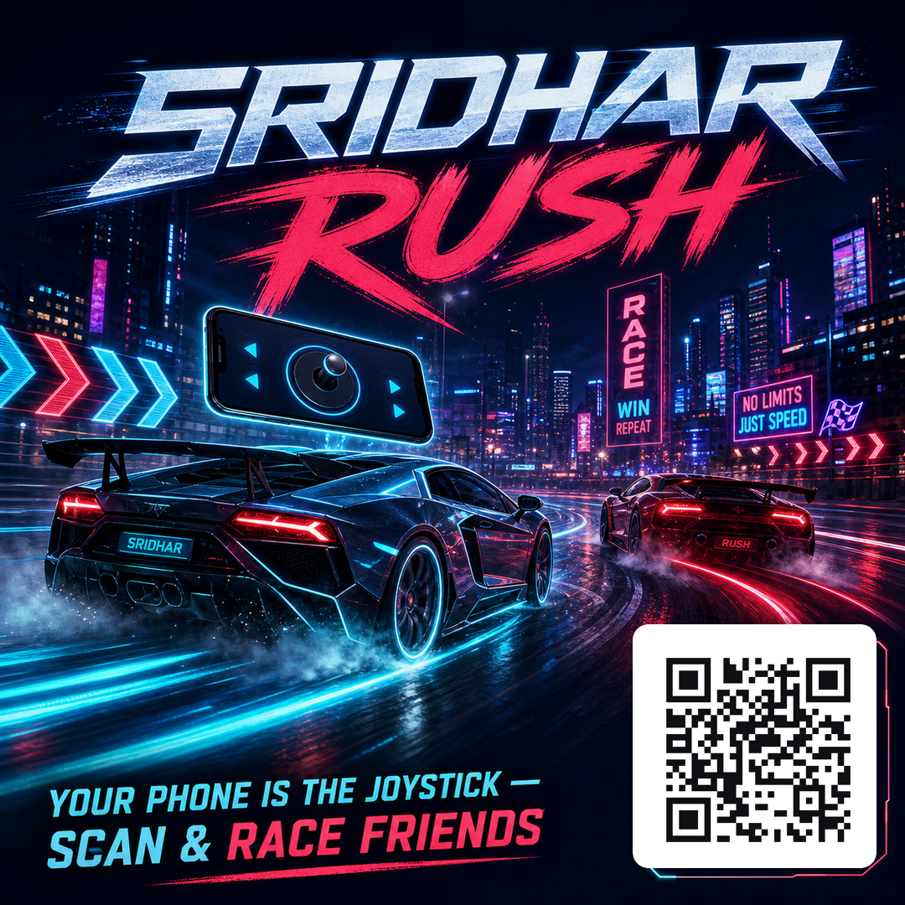

# SRIDHAR RUSH

<div align="center">


### **Browser-based real-time multiplayer 3D racing — where your phone becomes the steering wheel.**

[](https://sridhar-drift.vercel.app)
[](https://github.com/yathamsridharreddy/MULTIPLAYER-CAR-GAME)

[](test/)
[](public/js/game-core.js)
[](server.js)
[](public/js/game.js)
[](public/manifest.webmanifest)
[](public/js/i18n.js)
[](LICENSE)


*Zero downloads. Zero app-store friction. Open a tab, scan a QR code on the desktop screen, and any smartphone becomes a wireless dual-analog gamepad with haptics and gyro steering.*

</div>

---

## 📑 Table of Contents

1. [The Game](#-the-game)
2. [The Five Circuits](#-the-five-circuits)
3. [Your Phone Is the Joystick](#-your-phone-is-the-joystick)
4. [Competitive Hub](#-competitive-hub)
5. [Rivals, Revenge & Challenges](#-rivals-revenge--challenges)
6. [Progression & Cosmetics](#-progression--cosmetics)
7. [Clubs (Syndicates)](#-clubs-syndicates)
8. [Controls](#-controls)
9. [Racer Accounts & The Gate](#-racer-accounts--the-gate)
10. [Real Car Models](#-real-car-models)
11. [Architecture](#-architecture)
12. [Repository Layout](#-repository-layout)
13. [Run It Yourself](#-run-it-yourself)
14. [Development & Tests](#-development--tests)
15. [Version Highlights](#-version-highlights)
16. [License](#-license)

---

## 🌐 The Game

**🏁 Play now: [sridhar-drift.vercel.app](https://sridhar-drift.vercel.app)** — racer account required, no guest play.

SRIDHAR RUSH is a browser 3D racing game with an **authoritative multiplayer server**: drift-tuned arcade physics, rooms of up to six racers, a ranked competitive layer with daily and weekly cups, clubs with weekly milestones, and a revenge system where a grudge is a challenge your rival must **accept** before the rematch exists. Everything runs in a plain browser tab.

- 🏎️ **Arcade sim, server-authoritative at 30 Hz** — drift with the handbrake, burn a nitro meter, slipstream, photo-finish detection and server-validated lap records.
- 🌦️ **Four weather conditions** — Dry Asphalt ☀️, Wet Rain 🌧️, Midnight Neon 🌙, Alpine Blizzard ❄️ — each changing grip and drag.
- 🚗 **Three car classes** — Velocity (top speed), Accelerator (launch), Grip (cornering) — plus per-driver steering sensitivity.
- 🏎️ **Distinct body shells per class** — Velocity races the Valkyrie hyper wedge, Accelerator the Volt formula car, Grip the Monza grand tourer.
- 👻 **Ghosts & time trial** — your best lap becomes a ghost you race against, with live deltas.
- 🔁 **1, 3 or 5 lap races**, chosen in the lobby and shown correctly on every readout.
- ️ **Four languages** — English, తెలుగు, हिन्दी, Español — plus touch controls, gamepad support and an installable PWA shell.

---

## 🗺️ The Five Circuits

| | | |
|:---:|:---:|:---:|
| <br/>**HIGHLAND RUSH**<br/>Day · pine forests & mountain passes | <br/>**NEON CITY**<br/>Night · bloom-lit downtown cyber streets | <br/>**ISLAND MOTORFEST**<br/>Sunset · ocean coastlines & volcano roads |
| <br/>**CANYON CHICANE**<br/>Desert · high-speed S-curves & chicanes | <br/>**HAIRPIN GP**<br/>Snow · alpine hairpins & ice drifting | <br/>**RICH METADATA**<br/>dynamic Open Graph cards for every share |

---

## 📱 Your Phone Is the Joystick

<div align="center">

</div>

Every race screen draws a **QR code**. Scan it and the phone becomes a wireless controller for that seat: dual-analog steering, throttle/brake pedals, drift and nitro buttons, haptics and gyro steering on supported devices. Up to six screens plus spectators can share one room; phones and keyboards mix freely, and empty seats can be filled by **bots with tunable skill**.

---

## 🏆 Competitive Hub

Four live boards, each scoped **TOP 20** or **NEARBY (you ±3)** and filterable per circuit:

| Board | What it ranks | Reset |
| --- | --- | --- |
| **Global Rank** | Elo-style rating across ranked races | seasons |
| **Track Records** | best lap per circuit | never |
| **Daily Cup** | fastest lap of the day | 00:00 UTC |
| **Founders Cup** | the weekly competition | Monday 00:00 UTC |

Rank-movement cards show your climb, the summary bar always answers *"where am I?"* for the asker, and one tap shares your rank to WhatsApp or Telegram.

---

## ⚔️ Rivals, Revenge & Challenges

- The game tracks your **next rival** (the racer just above you) and the **chaser** behind you.
- Lose a race and a **grudge** is recorded. The revenge banner offers a rematch — clicking it **sends a challenge request** to the racer who beat you. They see it live (or in their lobby next visit) and **accept or decline**.
- **Only an accept creates the race:** the server seats you both in one room, bots off, and starts the countdown. Win it and a **+50% Revenge Bounty** pays out in bonus XP.
- Friends can also send **personal time challenges** with a target time and a share link.

---

## 📈 Progression & Cosmetics

XP & levels · daily and weekly **missions** with claimable rewards · login **streaks** · **seasons** with season rewards · earned **badges** · free cosmetics in the lobby (paint, decals, wheel finish, trail). All of it persists per verified racer identity — since **v119** there is no guest play: every racer signs up and signs in, and since **v121** the server itself refuses any non-controller connection without a valid Supabase session. (The old garage shop and Rush Coin economy were retired in v115.)

---

## 🛡️ Clubs (Syndicates)

Found or join a club, watch the roster and the **Championship Standings**, and collect **weekly milestone rewards** — each tier claimable once per member per week. Club counters roll over every **Monday 00:00 UTC**, and claims carry the week in their primary key so no week can be collected twice.

---

## 🎮 Controls

| Action | Keyboard | Touch / phone |
| --- | --- | --- |
| Steer | `A` / `D` or `←` / `→` | wheel / arrows |
| Accelerate | `W` or `↑` | pedal |
| Brake / reverse | `S` or `↓` | pedal |
| Drift / handbrake | `Space` | button |
| Nitro | `Shift` | button |
| Camera | `C` | — |

---

## 🔐 Racer Accounts & The Gate

Since **v119** the game sits behind a proper account gate on every deploy that
has Supabase keys configured: opening the site with no session redirects to
`auth.html` — a standalone page in the exact visual language of the lobby
(same fonts, same stylesheet, same neon lockup) with **SIGN IN**, **CREATE
ACCOUNT**, **FORGOT PASSWORD** and a **SET NEW PASSWORD** view for recovery
links. Sign up stores your racer name with the account; if the Supabase
project requires email confirmation the gate shows a "confirm your email"
step; the reset mail links back to the gate with a recovery token that swaps
straight into the new-password form. Only after a successful sign-in does the
lobby boot — **there is no guest play**. Expired tokens that cannot refresh
bounce back to the gate automatically. The phone controller and the replay
viewer stay open (they join by room code), and deploys without Supabase keys
(local development) skip the gate with a clearly-labelled dev notice. The gate
is pure client-side auth glue (`js/account.js` + `js/auth.js`, plain GoTrue
REST, no SDK); gameplay and physics never learned about it.

**v121 closes the last guest door at the server:** with Supabase configured,
the WebSocket handshake rejects every `hello` that is not a phone controller
and cannot verify a Supabase JWT, answering `auth-required` and closing the
socket - so even a hand-rolled client cannot race without an account. The
game client likewise never dials the relay unauthenticated and treats
`auth-required` as "back to the gate".

> Supabase console checklist for the live project: Auth → URL
> Configuration → add `https://sridhar-drift.vercel.app/auth.html` to
> **Redirect URLs** so recovery mails return to the gate.

## 🏎️ Real Car Models

Since **v117** the eight selectable racers can be driven by real licensed 3D
models instead of the procedural shells — a **visual-only** pipeline: physics,
collision, networking, spawn/respawn, camera and the phone controller never see
a GLB. `public/js/car-models.js` maps the paint hex that already travels on the
wire (`cs.col`) to a car id, loads `public/assets/cars/<id>/` asynchronously
through a vendored `GLTFLoader`, caches the parsed scene, clones it per slot,
rigs wheels/steering/brake lights from named nodes, normalises scale and
grounding, and recolours the paint materials. Any load failure keeps the
procedural shell with a console warning — a race never depends on a download.

Every bundled model ships its own `LICENSE.txt` next to the asset and is listed
in [ASSETS-CREDITS.md](ASSETS-CREDITS.md); only CC0 / CC-BY assets with
satisfiable attribution are accepted. Today `GHOST` runs the Khronos
**CarConcept** (CC-BY-4.0); the remaining slots run their own v118 procedural
silhouettes and upgrade automatically the moment a documented model is dropped
into their folder. Models are runtime-cached by the service worker (never
precached), so first load pays once and every later race is instant.

## 🧱 Architecture

<div align="center">

</div>

1. **Client (`public/`)** — plain HTML/CSS/JS, no bundler. `game-core.js` is the shared simulation, `game.js` the screen app, `controller.js` the phone wheel. A service worker precaches versioned assets (`?v=NNN`) so a deploy never serves mixed builds, and `js/config.js` is **generated at build time** from environment variables — no secrets ship in source.
2. **Game server (`server.js`)** — one Node process: the authoritative 30 Hz race sim, the WebSocket relay (screens, controllers, spectators), the REST API for boards, missions, clubs, revenge and ghosts, and boot-time schema diagnostics at `GET /health`.
3. **Database (Supabase / PostgreSQL)** — 25 tables with row-level security. The server writes with the service role; signed-in clients may write only their own verified rows. Guest identities are plain text keys, which is why identity columns are `text`, not `uuid`.

---

## 📁 Repository Layout

```
├── public/                      the website: index, controller, replay, assets
│   ├── js/game-core.js          shared physics/sim (client + server)
│   ├── js/game.js               screen app: lobby, HUD, hub, clubs, revenge
│   ├── js/controller.js         phone wheel page logic
│   ├── js/progression.js        missions, streaks, seasons, badges
│   ├── js/i18n.js               en / te / hi / es strings
│   └── sw.js                    service worker precache (cache name = build)
├── img/                         logo, posters, circuit cards, README artwork
├── server.js                    relay + authoritative sim + REST API
├── scripts/
│   ├── vercel-build.js          writes public/js/config.js from env vars
│   ├── sql-lint.js              parses every .sql against the Postgres grammar
│   └── live-probe.js            probes a deployed server's /health
├── supabase-setup.sql           canonical schema for a NEW database
├── supabase-migration-v98.sql   ONE re-runnable script that converges ANY database
├── supabase-migration-v99.sql   converges `challenges` for the revenge flow
├── supabase-migration-v94/96/97 superseded by v98 — kept for history, do not run
├── test/                        389 node:test tests (client harnesses + server + SQL)
└── LICENSE                      proprietary — All Rights Reserved
```

---

## 🚀 Run It Yourself

### Local
```bash
npm install
npm start                 # http://localhost:3000
```
Open a second tab — or your phone on the same network at `/controller?room=<CODE>` — to drive a seat. Without `SUPABASE_*` variables the server runs fully in RAM and says so in `/health`.

### Environment variables

| Variable | Where | Purpose |
| --- | --- | --- |
| `SERVER_URL` | frontend build | URL of the game server the client should talk to |
| `SUPABASE_URL`, `SUPABASE_ANON` | frontend build | baked into `config.js` for verified client calls |
| `COMMUNITY_WA`, `COMMUNITY_DC` | frontend build | community invite links shown in the lobby |
| `SUPABASE_URL`, `SUPABASE_SERVICE_ROLE` | game server | server-side persistence (service role) |
| `PORT` | game server | bind port (your host sets it) |
| `LOW_BANDWIDTH`, `CSP`, `FRAME_DENY` | optional | tick-rate reduction and security headers |

### Database
- **New project:** run [`supabase-setup.sql`](supabase-setup.sql) once in the SQL Editor.
- **Existing project:** run [`supabase-migration-v98.sql`](supabase-migration-v98.sql) — one file that converges *any* older shape (creates missing tables, converges all 165 columns and 15 indexes, relaxes identity columns `uuid → text`, recreates policies, widens the club claim key) — then [`supabase-migration-v99.sql`](supabase-migration-v99.sql), which converges the `challenges` table for the revenge request flow. Both are idempotent; v98 **supersedes v94, v96 and v97**.
- **Verify:** restart the game server and read `GET /health` — `persistence.verdict` should be `"ok"`, `playerStatsKeyType` `"text"`, and `crews` / `crewMembers` / `crewClaims` `"ok"`. Any other value names the exact migration that is missing.

### Deploy
- **Frontend:** any static host (this project uses Vercel: static output plus one OG-card function); the build step generates `config.js` from the env vars above.
- **Game server:** any Node host (this project uses Render): `npm start`. Rooms live in its memory; durable state lives in Supabase.

---

## 🧪 Development & Tests

```bash
npm test                  # 389 tests: client harnesses, server rooms, SQL invariants
npm run sql-lint          # every .sql parsed against the Postgres grammar
npm run probe             # probe a deployed game server's /health
```

Conventions worth knowing: client and server share `game-core.js`; every release bumps one build marker (`BUILD` in `game.js`, `/version` on the server, the service-worker cache name and the `?v=` asset tags) so caches never mix versions; migration files are **convergence scripts** — idempotent, guarded, safe to re-run — because production databases come in many shapes.

---

## 🔖 Version Highlights

- **v142** — real icons instead of emoji: every button, chip and HUD badge was drawn with emoji, which are FONT glyphs — so the interface was rendered by whatever emoji font the visitor's device happened to have (Apple on iPhone, Segoe on Windows, Noto on Android) and showed as an empty box on devices missing the codepoint. It also meant emoji could not be tinted to the game's palette, and different-shaped glyphs never lined up in a button. The site now ships a generated SVG icon set (28 icons in two styles: full-colour neon art for the controls, and single-tint masks for dense UI, where one CSS colour paints them while the internal depth is preserved), an `.ico` class that sits on the text baseline at any size, and slots for temperature, steering, camera, gamepad, restart and the connection banner wired up. The icon art is generated from geometry by `tools/icon-forge/make_icons.py` so it stays consistent, and a test now fails the build if an emoji creeps back into the wired UI or i18n dictionary
- **v141** — car picker: the car cards could come up as eight EMPTY boxes. The fallback swatch was assembled with `background:${hex}`, and a template literal turns a colour Number into the decimal string `14747136`, which is not a CSS colour, so the browser threw the declaration away; LOW quality skipped the 3D thumbnail outright, so exactly that path hit the blank swatch every time, and a dead `if (window._prev)` guard (a top-level `let` is not a `window` property) kept it from ever recovering. Cards now always show a car: LOW renders the real thumbnail once and hands the GL context straight back, MED/HIGH re-enable thumbnails, and a lost context rebuilds the picker instead of emptying it. When no GPU is available at all, the card falls back to a painted vector car silhouette rather than a blank rectangle
- **v140** — production hardening (stability · lag · connection): a lost WebGL context is now reclaimed instead of leaving a black frozen canvas (the top "sometimes it renders, sometimes it is broken" cause on mobile), an unavailable WebGL renderer explains itself rather than leaving a dead page, connections can no longer leak a second socket or storm-reconnect (generation-guarded dials, connect watchdog, 15 s silence detector), the relay heartbeats and reaps dead sockets, returning from a backgrounded tab re-dials instead of rendering a frozen world, the lobby no longer rebuilds its DOM and leaderboard 30×/second (the visible lobby lag), the bloom chain keeps its pixel ratio in step with adaptive resolution, a failing frame is contained and reported instead of silently skipping the render, and player names no longer show raw HTML entities
- **v139** — cars audit (wheels + glass + cost): the GLB wheel rig is rebuilt so the asset's baked-in front steering is gone (front wheels no longer sit ~21-26 deg crooked and mismatched while driving straight), wheels roll forward instead of backwards, brake calipers no longer spin with the wheel, tinted opaque glass replaces the transmission windscreen (no see-through hollow cabin, cheaper shader), wipers (24 336 tris) and the wheel shadow pass culled, rim/caliper materials cloned per car so one racer's cosmetic cannot recolour everybody
- **v138** — fix yellow car body damage: removed the v126 "yellow card" colour heuristic that hid any mesh whose paint matched r>200 && g>170 && b<130 — the yellow car's own paint 0xffd400 matched it, so roof/hood/doors/pillars were switched off; plate + interior culling now happens once per build, name-based only, with paint materials protected
- **v137** — friends adding by racer name: partial ilike %name% search, shows results with ADD per racer, excludes self/already friends
- **v136** — fix damaged bodies (clone GLB per car) + lag fix (512 shadow all, no second context on low/med, all procedural fallback = ghost)
- **v135** — fix rendering: revert SW aggressive bust that deleted current cache + caused blank, keep old-cache-only delete
- **v134** — fix old cars still showing: aggressive SW cache bust (delete all caches + reload clients), BUILD mismatch reload even in race, always new ghost GLB
- **v133** — fix old car models still showing: always use new ghost GLB for all 8 (remove low-quality skip), prefetch all 8 on lobby load, single URL cache
- **v132** — low-network & lag fix: disable FLAME decal, skip GLB on LOW quality, reduce shadow map 512, touch-action manipulation, fast pointerdown handlers, auto low-quality on 2g/saveData, map images on-demand not precached
- **v131** — fix old/new car flicker: cache GLB by URL not id (single download for all 8), force SW update
- **v130** — lobby account bar visible before CREATE (removed hidden) + name shows driver identity not email
- **v129** — restore ghost tiers (tyres) — keep Tire/Rim/Disc/Brake/Panel meshes that were hidden by ultra filter
- **v128** — all 8 cars now use ghost CarConcept GLB with their own colours (fury red, storm blue, volt yellow, etc)
- **v127** — yellow card was orange FLAME decal (0xff6a00) on hood appearing as yellow rectangle before car — disabled all decals + ultra-aggressive GLB interior hide
- **v126** — remove yellow card completely: hide all interior/mechanical meshes in GLB, keep only body/glass/lights (fixes yellow rectangle still showing in front of car)
- **v125** — remove yellow roof card (License Plate mesh hidden in GLB, all cars)
- **v124** — ghost car front/back fix: yaw 0° (was 180°), now faces track forward
- **v123** — CarConcept GLB double-tilt fix: car no longer stands on its nose; orientation corrected (GHOST slot).
- **v122** — sign-out now returns to the account gate (no more lobby with previous name after SIGN OUT) and clears the stored racer name.
- **v121** — no guests anywhere: server-side handshake enforcement (valid Supabase JWT required for every player/lobby/spectator socket; controllers exempt), client never connects unauthenticated, `auth-required` bounces to the gate, and the last guest strings/chips are purged.
- **v120** — password visibility: eye toggle on every password field of the account gate (sign in, create account, new-password), with aria labels and keyboard focus kept on the field.
- **v119** — racer account gate: standalone sign-in / sign-up / forgot-password page between the main page and the game, no guest play on configured deploys, recovery-link password reset, expired-session kick-back; phone controller and replay untouched; game code auth-agnostic.
- **v118** — eight distinct silhouettes: the shell generator is now parameterised and keyed to the car id (fury..reaper), so every lobby card and every car on the grid is its own machine - low-wide aggression, aero teardrop, sharp wedge, cockpit-forward tail, winged racer, canopy hyper, premium GT, stealth low - while physics stays class-based; licensed GLB models still override their slot.
- **v117** — real-car model pipeline: vendored GLTFLoader, per-slot async loading with caching, cloning, wheel/steer/brake rigging, paint recolour and procedural fallback; Khronos CarConcept (CC-BY-4.0, attributed) ships as GHOST; server and protocol stay model-agnostic.
- **v116** — restored the lobby ready-state declaration swallowed by the v115 slice; purged the last coin copy from the revenge banner (all four locales).
- **v115** — the garage, coin economy and equipped-loadout persistence are retired entirely: no shop, no wallet writes, no coin awards; body shells now follow the free class choice and cosmetics are free lobby picks.
- **v114** — realism pass: curved-surface body shells (no more faceted cardboard), reflective clearcoat paint and tinted glass that read the sky, glowing head/tail lenses, tire sidewalls, contact shadows that glue cars to the road; rain turns the asphalt into a glossy sky-reflecting slick and blizzard packs it snow-bright.
- **v113** — hotfix: the garage refresh now travels through a `window` export, so a net callback can never ReferenceError again.
- **v112** — every garage car now owns a distinct HD body shell (GT, night coupe, rally 4x4, Le-Mans prototype, open-wheel formula, hypercar wedge), synced to every screen in the room and previewed in the garage; neon underglow and spoilers finally sync too.
- **v111** — revenge became a request/accept head-to-head; stuck-key input fix; `challenges` converged for guest identities (v99).
- **v110** — lap readouts show the race length actually being run, not the default.
- **v109** — in-game fix instructions point at the convergent migration.
- **v108** — the client finds its server instead of assuming one, and says so when it cannot.
- **v98 / v99** — the convergence migrations that make any database, however old, match this README.

---

## 📜 License

**Copyright © 2026 Yatham Sridhar Reddy — All Rights Reserved.**

SRIDHAR RUSH is **proprietary, source-available software**. It is published for demonstration, portfolio, and educational reference only — it is **not** open source, and no rights are granted by implication, estoppel, or otherwise. Full terms: [`LICENSE`](LICENSE).

Permission requests: [yathamsridharreddy99@gmail.com](mailto:yathamsridharreddy99@gmail.com)

---

<div align="center">

### Built by **Yatham Sridhar Reddy**
*Cloud & DevOps Engineer · AWS Certified · OCI Architect · Real-Time Web Specialist*

[](https://www.linkedin.com/in/yatham-sridhar-reddy-744177374/)
[](https://yathamsridharreddy.github.io/sridhar-portfolio)
[](mailto:yathamsridharreddy99@gmail.com)

**🏁 Play now at [sridhar-drift.vercel.app](https://sridhar-drift.vercel.app)**

</div>
