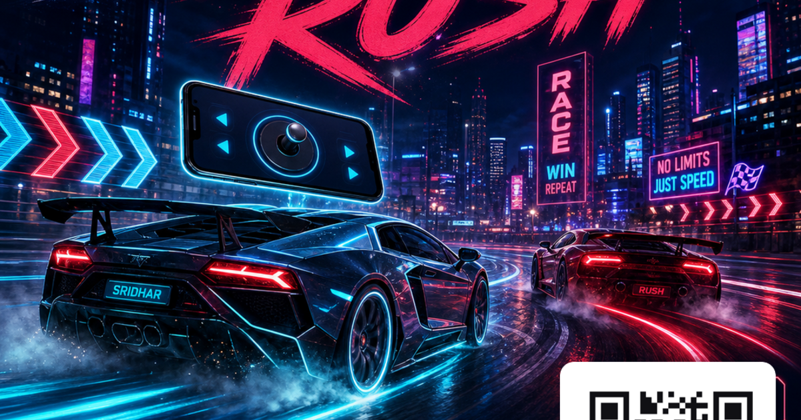
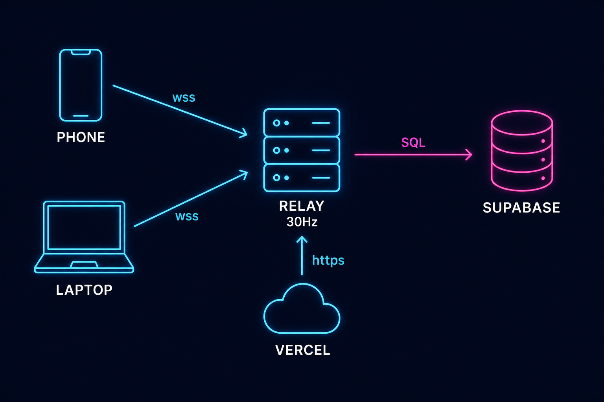

# SRIDHAR RUSH

<div align="center">


### **Browser-based real-time multiplayer 3D racing — where your phone becomes the steering wheel.**

[](https://sridhar-drift.vercel.app)
[](https://github.com/yathamsridharreddy/MULTIPLAYER-CAR-GAME)

[](test/)
[](public/js/game-core.js)
[](server.js)
[](public/js/game.js)
[](public/manifest.webmanifest)
[](public/js/i18n.js)
[](LICENSE)


*Zero downloads. Zero app-store friction. Open a tab, scan a QR code on the desktop screen, and any smartphone becomes a wireless dual-analog gamepad with haptics and gyro steering.*

</div>

---

## 📑 Table of Contents

1. [The Game](#-the-game)
2. [The Five Circuits](#-the-five-circuits)
3. [Your Phone Is the Joystick](#-your-phone-is-the-joystick)
4. [Competitive Hub](#-competitive-hub)
5. [Rivals, Revenge & Challenges](#-rivals-revenge--challenges)
6. [Progression & Cosmetics](#-progression--cosmetics)
7. [Clubs (Syndicates)](#-clubs-syndicates)
8. [Controls](#-controls)
9. [Racer Accounts & The Gate](#-racer-accounts--the-gate)
10. [Real Car Models](#-real-car-models)
11. [Architecture](#-architecture)
12. [Repository Layout](#-repository-layout)
13. [Run It Yourself](#-run-it-yourself)
14. [Development & Tests](#-development--tests)
15. [Version Highlights](#-version-highlights)
16. [License](#-license)

---

## 🌐 The Game

**🏁 Play now: [sridhar-drift.vercel.app](https://sridhar-drift.vercel.app)** — racer account required, no guest play.

SRIDHAR RUSH is a browser 3D racing game with an **authoritative multiplayer server**: drift-tuned arcade physics, rooms of up to six racers, a ranked competitive layer with daily and weekly cups, clubs with weekly milestones, and a revenge system where a grudge is a challenge your rival must **accept** before the rematch exists. Everything runs in a plain browser tab.

- 🏎️ **Arcade sim, server-authoritative at 30 Hz** — drift with the handbrake, burn a nitro meter, slipstream, photo-finish detection and server-validated lap records.
- 🌦️ **Four weather conditions** — Dry Asphalt ☀️, Wet Rain 🌧️, Midnight Neon 🌙, Alpine Blizzard ❄️ — each changing grip and drag.
- 🚗 **Three car classes** — Velocity (top speed), Accelerator (launch), Grip (cornering) — plus per-driver steering sensitivity.
- 🏎️ **Distinct body shells per class** — Velocity races the Valkyrie hyper wedge, Accelerator the Volt formula car, Grip the Monza grand tourer.
- 👻 **Ghosts & time trial** — your best lap becomes a ghost you race against, with live deltas.
- 🔁 **1, 3 or 5 lap races**, chosen in the lobby and shown correctly on every readout.
- ️ **Four languages** — English, తెలుగు, हिन्दी, Español — plus touch controls, gamepad support and an installable PWA shell.

---

## 🗺️ The Five Circuits

| | | |
|:---:|:---:|:---:|
| <br/>**HIGHLAND RUSH**<br/>Day · pine forests & mountain passes | <br/>**NEON CITY**<br/>Night · bloom-lit downtown cyber streets | <br/>**ISLAND MOTORFEST**<br/>Sunset · ocean coastlines & volcano roads |
| <br/>**CANYON CHICANE**<br/>Desert · high-speed S-curves & chicanes | <br/>**HAIRPIN GP**<br/>Snow · alpine hairpins & ice drifting | <br/>**RICH METADATA**<br/>dynamic Open Graph cards for every share |

---

## 📱 Your Phone Is the Joystick

<div align="center">

</div>

Every race screen draws a **QR code**. Scan it and the phone becomes a wireless controller for that seat: dual-analog steering, throttle/brake pedals, drift and nitro buttons, haptics and gyro steering on supported devices. Up to six screens plus spectators can share one room; phones and keyboards mix freely, and empty seats can be filled by **bots with tunable skill**.

---

## 🏆 Competitive Hub

Four live boards, each scoped **TOP 20** or **NEARBY (you ±3)** and filterable per circuit:

| Board | What it ranks | Reset |
| --- | --- | --- |
| **Global Rank** | Elo-style rating across ranked races | seasons |
| **Track Records** | best lap per circuit | never |
| **Daily Cup** | fastest lap of the day | 00:00 UTC |
| **Founders Cup** | the weekly competition | Monday 00:00 UTC |

Rank-movement cards show your climb, the summary bar always answers *"where am I?"* for the asker, and one tap shares your rank to WhatsApp or Telegram.

---

## ⚔️ Rivals, Revenge & Challenges

- The game tracks your **next rival** (the racer just above you) and the **chaser** behind you.
- Lose a race and a **grudge** is recorded. The revenge banner offers a rematch — clicking it **sends a challenge request** to the racer who beat you. They see it live (or in their lobby next visit) and **accept or decline**.
- **Only an accept creates the race:** the server seats you both in one room, bots off, and starts the countdown. Win it and a **+50% Revenge Bounty** pays out in bonus XP.
- Friends can also send **personal time challenges** with a target time and a share link.

---

## 📈 Progression & Cosmetics

XP & levels · daily and weekly **missions** with claimable rewards · login **streaks** · **seasons** with season rewards · earned **badges** · free cosmetics in the lobby (paint, decals, wheel finish, trail). All of it persists per verified racer identity — since **v119** there is no guest play: every racer signs up and signs in, and since **v121** the server itself refuses any non-controller connection without a valid Supabase session. (The old garage shop and Rush Coin economy were retired in v115.)

---

## 🛡️ Clubs (Syndicates)

Found or join a club, watch the roster and the **Championship Standings**, and collect **weekly milestone rewards** — each tier claimable once per member per week. Club counters roll over every **Monday 00:00 UTC**, and claims carry the week in their primary key so no week can be collected twice.

---

## 🎮 Controls

| Action | Keyboard | Touch / phone |
| --- | --- | --- |
| Steer | `A` / `D` or `←` / `→` | wheel / arrows |
| Accelerate | `W` or `↑` | pedal |
| Brake / reverse | `S` or `↓` | pedal |
| Drift / handbrake | `Space` | button |
| Nitro | `Shift` | button |
| Camera | `C` | — |

---

## 🔐 Racer Accounts & The Gate

Since **v119** the game sits behind a proper account gate on every deploy that
has Supabase keys configured: opening the site with no session redirects to
`auth.html` — a standalone page in the exact visual language of the lobby
(same fonts, same stylesheet, same neon lockup) with **SIGN IN**, **CREATE
ACCOUNT**, **FORGOT PASSWORD** and a **SET NEW PASSWORD** view for recovery
links. Sign up stores your racer name with the account; if the Supabase
project requires email confirmation the gate shows a "confirm your email"
step; the reset mail links back to the gate with a recovery token that swaps
straight into the new-password form. Only after a successful sign-in does the
lobby boot — **there is no guest play**. Expired tokens that cannot refresh
bounce back to the gate automatically. The phone controller and the replay
viewer stay open (they join by room code), and deploys without Supabase keys
(local development) skip the gate with a clearly-labelled dev notice. The gate
is pure client-side auth glue (`js/account.js` + `js/auth.js`, plain GoTrue
REST, no SDK); gameplay and physics never learned about it.

**v121 closes the last guest door at the server:** with Supabase configured,
the WebSocket handshake rejects every `hello` that is not a phone controller
and cannot verify a Supabase JWT, answering `auth-required` and closing the
socket - so even a hand-rolled client cannot race without an account. The
game client likewise never dials the relay unauthenticated and treats
`auth-required` as "back to the gate".

> Supabase console checklist for the live project: Auth → URL
> Configuration → add `https://sridhar-drift.vercel.app/auth.html` to
> **Redirect URLs** so recovery mails return to the gate.

## 🏎️ Real Car Models

Since **v117** the eight selectable racers can be driven by real licensed 3D
models instead of the procedural shells — a **visual-only** pipeline: physics,
collision, networking, spawn/respawn, camera and the phone controller never see
a GLB. `public/js/car-models.js` maps the paint hex that already travels on the
wire (`cs.col`) to a car id, loads `public/assets/cars/<id>/` asynchronously
through a vendored `GLTFLoader`, caches the parsed scene, clones it per slot,
rigs wheels/steering/brake lights from named nodes, normalises scale and
grounding, and recolours the paint materials. Any load failure keeps the
procedural shell with a console warning — a race never depends on a download.

Every bundled model ships its own `LICENSE.txt` next to the asset and is listed
in [ASSETS-CREDITS.md](ASSETS-CREDITS.md); only CC0 / CC-BY assets with
satisfiable attribution are accepted. Today `GHOST` runs the Khronos
**CarConcept** (CC-BY-4.0); the remaining slots run their own v118 procedural
silhouettes and upgrade automatically the moment a documented model is dropped
into their folder. Models are runtime-cached by the service worker (never
precached), so first load pays once and every later race is instant.

## 🧱 Architecture

<div align="center">

</div>

1. **Client (`public/`)** — plain HTML/CSS/JS, no bundler. `game-core.js` is the shared simulation, `game.js` the screen app, `controller.js` the phone wheel. A service worker precaches versioned assets (`?v=NNN`) so a deploy never serves mixed builds, and `js/config.js` is **generated at build time** from environment variables — no secrets ship in source.
2. **Game server (`server.js`)** — one Node process: the authoritative 30 Hz race sim, the WebSocket relay (screens, controllers, spectators), the REST API for boards, missions, clubs, revenge and ghosts, and boot-time schema diagnostics at `GET /health`.
3. **Database (Supabase / PostgreSQL)** — 25 tables with row-level security. The server writes with the service role; signed-in clients may write only their own verified rows. Guest identities are plain text keys, which is why identity columns are `text`, not `uuid`.

---

## 📁 Repository Layout

```
├── public/                      the website: index, controller, replay, assets
│   ├── js/game-core.js          shared physics/sim (client + server)
│   ├── js/game.js               screen app: lobby, HUD, hub, clubs, revenge
│   ├── js/controller.js         phone wheel page logic
│   ├── js/progression.js        missions, streaks, seasons, badges
│   ├── js/i18n.js               en / te / hi / es strings
│   └── sw.js                    service worker precache (cache name = build)
├── img/                         logo, posters, circuit cards, README artwork
├── server.js                    relay + authoritative sim + REST API
├── scripts/
│   ├── vercel-build.js          writes public/js/config.js from env vars
│   ├── sql-lint.js              parses every .sql against the Postgres grammar
│   ├── live-probe.js            probes a deployed server's /health
│   ├── restore-clubs.*          prints SQL that rebuilds the club tables from a
│   │                            running server's memory (.js = Node, .html = browser)
│   ├── clean-deleted-racers.sql erases accounts deleted before v158's trigger,
│   │                            repairs the clubs they were in, prints a report
│   ├── remove-club-member.sql   removes one person from one club by the name,
│   │                            key or alias the roster shows; refuses rows of
│   │                            living accounts
│   ├── rename-club.sql          renames a club (and its tag/motto/badge/colour)
│   │                            with the game's own validation; a running server
│   │                            picks it up without a restart
│   ├── delete-club.sql          deletes one club with its roster and claims, for
│   │                            when the leader's account is gone; refuses the
│   │                            game's own clubs and any ambiguous name
│   └── clean-stale-tombstones.sql clears the tombstones that name an account
│                                Supabase STILL HAS - the row that made every
│                                club join answer "this account was deleted"
├── supabase-setup.sql           canonical schema for a NEW database
├── supabase-migration-v98.sql   ONE re-runnable script that converges ANY database
├── supabase-migration-v99.sql   converges `challenges` for the revenge flow
├── supabase-migration-v158.sql  deleting a user in Auth really deletes the user
│                                (the purge machine is also inside v98/setup.sql)
├── supabase-migration-v94/96/97 superseded by v98 — kept for history, do not run
├── test/                        389 node:test tests (client harnesses + server + SQL)
└── LICENSE                      proprietary — All Rights Reserved
```

---

## 🚀 Run It Yourself

### Local
```bash
npm install
npm start                 # http://localhost:3000
```
Open a second tab — or your phone on the same network at `/controller?room=<CODE>` — to drive a seat. Without `SUPABASE_*` variables the server runs fully in RAM and says so in `/health`.

### Environment variables

| Variable | Where | Purpose |
| --- | --- | --- |
| `SERVER_URL` | frontend build | URL of the game server the client should talk to |
| `SUPABASE_URL`, `SUPABASE_ANON` | frontend build | baked into `config.js` for verified client calls |
| `COMMUNITY_WA`, `COMMUNITY_DC` | frontend build | community invite links shown in the lobby |
| `SUPABASE_URL`, `SUPABASE_SERVICE_ROLE` | game server | server-side persistence (service role) |
| `PORT` | game server | bind port (your host sets it) |
| `LOW_BANDWIDTH`, `CSP`, `FRAME_DENY` | optional | tick-rate reduction and security headers |

### Database
- **New project:** run [`supabase-setup.sql`](supabase-setup.sql) once in the SQL Editor.
- **Existing project:** run [`supabase-migration-v98.sql`](supabase-migration-v98.sql) — one file that converges *any* older shape (creates missing tables, converges all 170 columns and 16 indexes, relaxes identity columns `uuid → text`, recreates policies, widens the club claim key) — then [`supabase-migration-v99.sql`](supabase-migration-v99.sql), which converges the `challenges` table for the revenge request flow. Both are idempotent; v98 **supersedes v94, v96 and v97**.
- **Already live before v158?** Everything above converges the schema, but the *account
  deletion* machinery (the trigger on `auth.users`, the purge function and the tombstone
  table) is what makes deleting a racer in Authentication → Users delete their profile,
  wallet, ledger, garage, stats, records, history, missions, bounties, badges, seasons,
  cups, ghosts, leaderboard times, club roster row and club mileage with them. It is in
  v98 and in `supabase-setup.sql` as well, so re-running v98 is enough; running
  [`supabase-migration-v158.sql`](supabase-migration-v158.sql) on its own does the same
  and also sweeps the accounts that were already deleted before it existed.
- **Verify:** restart the game server and read `GET /health` — `persistence.verdict` should be `"ok"`, `playerStatsKeyType` `"text"`, and `crews` / `crewMembers` / `crewClaims` `"ok"`. Any other value names the exact migration that is missing.

### Deploy
- **Frontend:** any static host (this project uses Vercel: static output plus one OG-card function); the build step generates `config.js` from the env vars above.
- **Game server:** any Node host (this project uses Render): `npm start`. Rooms live in its memory; durable state lives in Supabase.

---

## 🧪 Development & Tests

```bash
npm test                  # 389 tests: client harnesses, server rooms, SQL invariants
npm run sql-lint          # every .sql parsed against the Postgres grammar
npm run probe             # probe a deployed game server's /health
```

Conventions worth knowing: client and server share `game-core.js`; every release bumps one build marker (`BUILD` in `game.js`, `/version` on the server, the service-worker cache name and the `?v=` asset tags) so caches never mix versions; migration files are **convergence scripts** — idempotent, guarded, safe to re-run — because production databases come in many shapes.

---

## 🔖 Version Highlights

- **v168** — MAP 0: the car stays ON the road. HIGHLAND RUSH is the one track whose surface and barrier came from two different ideas: the asphalt ribbon is 16 m wide, but the ground beside it is a bank that runs from metres above the road (where the road is a cutting) to metres below it (where it is an embankment) - and the height function measured "how far off the road am I" along the ray from the middle of the oval while the barrier clamp measured it as a true perpendicular, so near the diagonals the car was placed on the bank, not on the road. The road corridor in the terrain field was misaligned the same way, which is why the hillside also hung over the tarmac. Now: the ellipse measures lateral distance with the projection the clamp uses and takes the road's height at the foot of that perpendicular; ON the asphalt the ribbon is the surface (off it the drawn ground still is, and never below the road); and MAP 0 keeps the whole car on the asphalt - the nose and tail stop at the road edge, so the body never overhangs the grass. The terrain grid is drawn finer (300 segments instead of 140) so nothing overhangs the asphalt by more than centimetres. Maps 1-4 are untouched: they keep their own fenced limits, and the car still never sinks below the ground it is drawn on.
- **v167** — offline mode removed: the site is back to exactly what it was at v164. The OFFLINE entry in the mode row, the local-race transport, the SAVE FOR OFFLINE step and the offline service-worker shell are all gone; the service worker is back to its earlier job (installable app, fast repeat visits) and nothing in the lobby or the race changes how it worked before. Only the version sticker moved forward (v167) rather than back (v164), so no browser or service worker can keep serving the removed build out of a cache. One unrelated fix stays: when a deleted account's session is signed out and the guest retry is itself refused, the join note no longer claims "you joined as a guest" - it says the old account was signed out first.
- **v164** — the car drives on the ground the player sees. `build3DTerrain()` draws every map as a `PlaneGeometry(1600, 1600, 140, 140)` — one height per grid point, flat triangles in between — while the car's visual Y came from the analytic heightfield, blended from the road out to the terrain over 6 units where the drawn terrain blends over 26. Beside the track the two disagree by metres: measured on Map 0, **28% of the map had the car below the ground it was drawn on, worst case 3.79 m** — which is exactly what "the car is fully hiding below the grass" looks like. The car (and the ghost, the skid marks, the dust and the camera fallback, which all read the same function) now samples the drawn surface itself: `build3DTerrain` hands its own grid to `buildTerrainSample()` and `getSurfaceY()` interpolates inside the SAME two triangles the renderer draws ((a,b,d) and (b,c,d)), so the car sits on the visible facet and can never be under it. On the asphalt it still rides the ribbon (`getTrackElevation + 0.08`), and wherever the coarse terrain interpolates a little above the ribbon at the kerb it rides the ground instead — the ground is what is drawn. Verified against the vendored three.js: the sampler matches a barycentric lookup in the real index buffer to 1e-4, and a sweep of the whole drivable area of all five maps finds the car below the drawn ground **0 times** (was 28% on Map 0). Build marker is `v164`, so `/version` says at a glance which server is deployed; the asset/cache version is bumped with it so a browser holding an older client picks the new one up.
- **v163** — the tombstone stops being the last word on a living account. A tombstone row is written when an account is deleted in Supabase, and it is the server's list of identities it will not write again. But a row there can also name an account that can still sign in - a key an operator erased by hand with one of the SQL tools, an admin purge called with the wrong id, a leftover from a half-finished cleanup. The result was a trap with no way out from the screen: every club join answered `403 racer_erased` ("sign out and sign up again"), and signing in again handed back the *same* account id, so the refusal repeated for ever. The join (and create) endpoint now asks the only authority that can settle it - `GET /auth/v1/admin/users/{id}` with the service role - and if Supabase still has the user, the stale tombstone rows are deleted and forgotten in memory, and the join goes through on the account as normal. If Supabase does not have them, the refusal stands: that IS a deleted account. If the question cannot be asked (Auth unreachable), the answer is honest instead of guessed - `503 account_check_failed` and the client says the check could not be reached. On the client side a `racer_erased` answer while this browser holds a session no longer hands the racer advice they cannot act on: it clears the dead session and retries the same click as a guest, and the join tab says the deleted account was signed out first. `scripts/clean-stale-tombstones.sql` does the server-side half by hand (preview, delete, verify) for a deploy that cannot be updated yet; it only ever removes a tombstone whose key is a uuid that `auth.users` still has, and a running server needs one restart to forget it.
- **v162** — the last two ways a join could store nothing, and the reason written down. A browser with no device key at all (cleared storage, a private window) sends the driver name as its identity: the roster row is then keyed on that name, so a name a tombstone carries dropped the row for *every* club - the racer was outside every club they clicked, which is exactly what "I cannot join any clubs" looks like. That shape now gets a device key minted in the same request, like an erased device key does. And because a toast fades in four seconds, the join tab keeps the last attempt on screen in words ("LAST ATTEMPT - ..."): a refusal names its reason, a server that is waking up names its HTTP status, and a join that landed says which club took the racer.
- **v161** — no club click can end in silence. Every club call used to read its answer with `.then(r => r.json())`; a server that was waking up (a cold Render instance answers 502 with an HTML page), a proxy error page or an empty body made that throw, and the catch told the racer to "check your connection" — a true answer to the wrong question, and a click that appears to do nothing is exactly what "I cannot join the club" looks like. All three club POSTs (join, create, delete) now go through one reader that returns the HTTP status and whatever body arrived and never throws: a refusal still names its reason, and anything else names the status ("The club server is waking up (HTTP 502) - wait a few seconds, then try again").
- **v160** — deleting a racer in Supabase can no longer lock a living racer out of clubs. Two facts combined into a dead end: the client puts the driver name in the `uid` identity slot (`crewIdentity()` in `game.js`), so a signed-in racer's roster row is keyed by their *display name*; and the v158 purge widens its key set from that roster row, so deleting the account records the display name as a tombstone **key** (verified against the shipped migration - the tombstone rows come out as `sridhar`, `sb:sridhar`, `<uuid>`, `sb:<uuid>`). Every write naming a tombstone key is dropped by design, and v159.1 refused the later join outright, so the same person signing up again with the same driver name got `403 racer_erased` for ever with no way back; a guest whose *device* id was erased was in the same trap, because that id is minted once and resent by the browser on every request. The join and create endpoints now settle the identity first: a live account (`sbUid` present and not tombstoned) is never the erased racer, so a display name or a old device key a tombstone names is simply replaced by the account id and the roster row is stored; a tombstoned uuid-shaped key with no live account is a deleted account and is still refused with `403 racer_erased`; and a guest whose keys are gone is given a fresh device key in the same request, with the answer carrying `newPid` + `reset: true` so the client adopts it before its next call and the toast says "this device's old racer was deleted, so you start fresh". An existing roster row keyed by a tombstoned value is re-keyed on the live identity, so a membership that could never be written again is repaired instead of silently dropped. The club buttons, the refusal wording, the leader-facing delete-club action and `scripts/delete-club.sql` all carry over from v158.8/v159.
- **v159** — the club buttons work on a fresh page, and a join that cannot be stored says so. Two separate faults sat behind "I clicked JOIN CLUB and I could not join". The first was wiring: every club control (CLUBS, the four tabs, the JOIN buttons inside them) was wired only from the last line of `updateLobby()` — i.e. after the first room snapshot arrived, and after roughly fifty DOM operations that can throw on the way there — so a racer who had not entered a room yet, or whose lobby render bailed early (a failed WebGL car preview is enough), had a CLUBS button with no click handler at all; it now wires at boot as well, and a browser-level test drives the real page and clicks the real buttons. The second was the write: the purge's outbound filter treated a tombstone *name* as decisive, so a racer whose driver name matches a name a deleted account used had every club write silently dropped — the join answered `200 {ok:true}`, the toast said "Joined!", the roster row never reached the database, and the next reload put them back outside the club. A tombstone key is still decisive; a name now only erases an identity that is nothing but that name. A join also answers with `stored` / `durable` / `pending`, an erased racer gets `racer_erased` instead of a fake success, and the client says which of those happened rather than one "Failed to join crew" toast. With it: a leader can delete their own club from MY CLUB (the confirmation names the club and its racers, the game's own clubs refuse), `scripts/delete-club.sql` does the same when the leader's account is gone, the create form is 3–32 characters like the server, and the build marker is `v159` so `/version` says at a glance which server is deployed.
- **v158** — deleting a racer deletes the racer. Removing the account in Supabase (Authentication → Users → Delete) removed the auth row and nothing else: their rating, XP, lap records, race history, achievements, coins, missions, bounties, badges, daily and weekly cup rows, ghost laps and leaderboard times all stayed behind, still counting towards their old club's weekly total, and a warm game server could flush some of it back. The cause was deliberate: v97–v99 dropped every foreign key to `auth.users`, because identity columns are text and hold guest keys (a device pid, a display name) that no account owns — a constraint that only ever rejected rows also gave the database nothing to cascade with. So the database gets the purge it should have had: `sr_purge_identity()` erases a racer from every table the game writes, matching any identity they are known by, repairs the clubs they were in (totals stop counting them, leadership passes on, an empty un-seeded club goes), and records a tombstone; an `AFTER DELETE` trigger on `auth.users` calls it, so the dashboard delete is the whole operation; `sr_purge_orphans()` sweeps the accounts that were already deleted. The server polls the tombstone table and drops the racer from its ten in-memory caches — including their club roster row and the account-lite board — refuses to hydrate them again, and refuses to write them back if a race was already running when the account went, because a cache is exactly how a deleted account comes back. `POST /api/admin/purge` runs the same purge from inside the game, for anyone who would rather not open the dashboard.
- **v157** — the blue car is a deep blue. The second paint in the palette was `0x0a84ff`, an electric azure that read as light blue on the track and in its card; it is now `0x0d47c8`, a deep royal blue. The paint, the card portrait, the lobby entry, the fallback silhouette and the AI rival's car all carry the one colour, and nothing else on the site changed.
- **v156** — clubs became somewhere you can look around. The directory knew how many racers a club had but never their names, so a club tag on a car in a lobby meant nothing until you joined it yourself. Any racer can now open any club and read its roster: who runs it, every member by name, their role and what each has put in this week, with your own row marked. It is public, so what leaves the relay is only what a club would expect a stranger to see — a display name, a role and a contribution, never the account uuid, device pid or alias list the settlement path runs on. Reachable from the club list (WHO'S IN on every card) and from the championship standings table, and translated like the rest of the site.
- **v155** — one car per racer, and one racer in charge of the room. Two racers could pick the same car and end up in identical machines on the grid; now a car belongs to whoever is driving it. Arriving in a room claims the first car nobody has, changing into somebody else's is refused, and the losing card is marked with the driver's name and cannot be clicked — so the car list reads as a grid rather than a menu. The room creator owns the circuit, the weather, the lap count and the AI rival: those four are refused at the relay for everyone else, whatever their browser sends, and the wizard shows the room's real values on a locked control rather than pretending. Everyone in the room can still pick a car, and a racer on their own still owns every setting.
- **v154** — the drift fire was one flat layer of streaks. It now has the four things that make fire read as fire at speed: a white-hot core running down the middle of every trail; a long soft glow lying flat on the asphalt under it, which is what makes it look like something happening to the road rather than sprites floating above it — and which stays readable from the low chase angle where a thin trail is edge-on; tire smoke that grows as it rises, fades in and back out instead of snapping on, is lit amber while the tire is burning and grey once it is not, and keeps rolling for a moment after the flames are out, the way it does in life; and the trail now starts AT the tire, offset back by a third of its length so the hot end sits on the contact patch instead of half the streak poking out in front of the wheel. Emission roughly doubled again so the layers overlap into one continuous burn, and the smoke pool — which the old skid marks were the only caller of — is retuned for a sliding tire: frame-rate independent, longer-lived, and better distributed across the emission tick.
- **v153** — the tire fire looked like a row of dots, not like fire. v152 emitted round additive puffs at the contact patch; a sliding tire actually lays a long streak down the road, so every particle is now a comet — hot core at the tire, soft tail behind it — and each one is stretched and aimed along the direction it is really travelling, with the camera's own axes recomputed each frame so the streaks stay true while the chase camera swings. The flames cling to the road instead of lifting, splay a few degrees outward so a drifting car drags two trails that part company behind it, and the whole smear lengthens with speed. Emission roughly doubled and the grains were made to overlap, so the trail is continuous rather than beaded, and every layer has a floor under it — a front tire that is only just washing out still leaves a 0.95 m streak, never a speck.
- **v152** — the black skid marks are gone, replaced by tire fire. Drifting used to paint two flat near-black quads under the rear axle; now the tires that are actually slipping throw flames, embers and sparks off their contact patches, with the friction smoke the game already had rising out of the same spot. It is driven by the same physics slip the marks used (`sl > 4.5` at speed, released at `3.6` so a car on the limit cannot strobe), the rear axle lights first and the fronts only join in once the slide washes them out, emission is on a timer so six drifting cars cannot flood the pool, and a tire that hooks up puts its fire out immediately instead of smouldering. Rendering only — physics, steering, collision, drift scoring and the snapshot protocol are untouched.
- **v151** — the icons were the wrong size and the labels were in the wrong typeface. v149 had wired every icon but left them at `1em` of an 11px button, so a glyph came out *smaller than the letter beside it*; and the tab labels, section titles and card titles were set in Orbitron at 11–12px with heavy tracking. Orbitron is a wide display face — it is what makes a scoreboard read like a scoreboard, and it is genuinely hard to read as a UI label that small. Labels (tabs, buttons, chips, section and card titles) now use Chakra Petch, a HUD face drawn for exactly that size, and Orbitron is kept for what it is good at: the display numerals and headings. Icons state their size per context (14–16px in chrome, 23px in the mode cards, scaling inside headings), the containers are flex rows with a real gap instead of per-icon margins, and each control carries an accent so the row reads as a toolbar: clubs green, badges gold, bounties amber, friends violet, account cyan, with the active tab lighting its own icon. Same pass fixes the bug from the screenshot — two renderers still concatenated an icon *name* into the markup, so the account row printed the words `medal flame bolt ghost globe`; a test now fails if any icon field is ever written as text.
- **v150** — the achievement tiles, missions and club emblems stopped being emoji. The profile pane never read its glyphs out of the markup — it reads them out of tables: the 14 achievement tiles, the daily missions, the weekly bounties, the milestone badges, the streak rewards and the club presets. Two of the 14 tiles were the same target glyph, which is how you could tell nobody had looked at the row, and one carried a lone U+FE0F, an empty string that rendered as nothing. They name icons now, each tile takes its own accent instead of one shared gold, and a club emblem created before the picker changed still renders — clubs already in the database must not break.
- **v149** — the chrome stopped being emoji. 149 emoji were doing the work of icons in `index.html` alone, drawn by whatever emoji font the visitor's device ships (Apple, Segoe and Noto all disagree) and shown as an empty tofu box where the font has no such character — status badges, tab labels, buttons, dialog titles. The set is now 100 real icons on one 128-unit grid: the identity icons (car, helmet, flag, nitro, speedo…) stay hand-drawn, the utility icons (gear, globe, user, chart, key, star…) come from Lucide and are re-emitted on the same grid, with the ISC attribution recorded in `ASSETS-CREDITS.md`. Every icon is a CSS mask, so it tints with the text colour and stays crisp at any DPI. Because the labels are re-rendered at runtime, the fix had to reach into `game.js` as well — `chip.textContent = '👤 ' + name` was putting the emoji straight back and deleting the icon that the markup now carries, so 50 chrome sites write into a label span instead. Toasts, share text and the turtle/rabbit sensitivity ends keep their emoji on purpose: those are sentences, not chrome. The catalogues behind the data-driven chrome were emoji too, which is why cleaning the markup never reached them: the 14 achievement tiles on the profile pane, the daily-mission titles, the weekly bounties, the milestone badges and the club emblems all drew their glyph out of a table. One entry carried a lone U+FE0F - an empty string that rendered as nothing. They name icons now, each tile takes its own accent (two of the tiles were the same target glyph, which is how you could tell nobody had looked at the row), and a club emblem created before the picker changed still renders, because clubs already in the database must not break. Same pass: `public/icon.svg` is no longer `<text>🏎️</text>` (a font glyph standing in for an app icon), the manifest ships a genuinely padded maskable PNG instead of reusing the "any" file for a purpose that crops it, the three mode buttons and every other card got their styles off positional selectors (`span:first-child` is what broke the weather row), every interactive element gained the cyan `:focus-visible` ring, and the Google Fonts request dropped three weights nobody referenced while adding the 400 face Rajdhani was actually missing.
- **v148** — the circuit cards now show the circuit. They had the same shape of problem the weather row had: the picture sat in an inset thumbnail inside a grey box, every card's accent was the same cyan, and the row could go ragged — "ISLAND MOTORFEST" wrapped and grew its card taller than the four beside it. The circuit is now the card: a full-bleed picture at one fixed height, its own accent on the spine, active border and title (highland green, neon magenta, sunset orange, canyon rust, ice cyan), and a title block that reserves two lines so five cards can never come out uneven. The row uses `auto-fit`, so five circuits fill the panel instead of leaving an empty track. The car cards' shared `.mc-name` rule was preserved and is now guarded by a test — scoping a rule is one edit away from silently stripping another card's font
- **v147** — the weather cards now show the CONDITION the way the car cards show the car: a real picture of dry tarmac, rain-soaked asphalt, neon-lit night or a snow-covered mountain road, with a scrim over it so the text always has contrast. The old layout put the icon beside a cramped three-line stack (title, a boxed chip, description) that also made the cards tall and ragged; it is now two calm rows — icon + title, then grip + detail — with the condition's accent carried by the rail, the tile ring and the grip chip. v146 fixed how the parts were styled (they were picked with `span:first-child`, so the title fell through to the browser's default button font); v147 fixed how the card is built
- **v146** — the weather row finally looks like part of the game. It was styled with `span:first-child` / `span:last-child`, written for a card whose first child is the title — but on this row the first child is the icon, so the icon got the display font, the title fell through to the browser's default button font, and the description (actually the last child) wore the muted style while a second line wrapped underneath. All four conditions were the same grey box. Each part now has its own class, and each weather carries an accent, a tinted icon tile and its own atmosphere (sun glow, rain streaks, neon stars, alpine streaks). The grip figure — the number you actually compare between the four cards — is pulled out of the label into a colour-coded chip, split from the translated text so every language keeps working and no balance number is duplicated in the client. The row drops to two even columns below 900px instead of stranding the fourth card, and the chosen condition gets an accent border, a lit top bar and a visible focus ring
- **v145** — the car cards finally look like cars. Each card used to be drawn live from the game's own 3D models into a SECOND WebGL context, one render per card: it cost a GPU context every time the picker opened, it was skipped outright on LOW quality (so those players got the flat silhouette), and it could only ever be as good as the low-poly model it drew. The eight cards now show baked portraits (`public/img/cars/<id>.webp`, under 60 KB each, colour-matched neons, one camera and one lighting rig across the set), so the picker is identical on every device, needs no GPU, and opens instantly. The drawn vector car stays as the fallback, so the v141 guarantee still holds — a card can never come up empty, even if the picture is missing or fails to decode — and the whole preview pipeline was deleted rather than left as dead weight. Source renders and the licensing note are recorded in ASSETS-CREDITS.md
- **v144** — your driver name now belongs to your ACCOUNT, not to one browser. It was kept in `localStorage` only, so signing in on a second device left the lobby showing that device's placeholder — which made it look like the wrong account was signed in — and a name with a space could not be stored on the account at all. Worse, SIGN IN re-uploaded the profile with whatever name the device happened to hold, so signing in from somewhere else could rename the account. The name now lives in `profiles.display_name` (free-form, not unique — `username` stays the unique handle) and is adopted at sign-in, so the racer's real name is on screen before anything is typed. Sign-in never writes; CREATE and every later rename do, through one debounced writer shared by the DRIVER IDENTITY field, the account dialog and the profile panel. Separately, the identity was only painted from `updateLobby()`, i.e. on the first server snapshot — so the lobby sat on index.html's static `👤 racer` markup until a state frame arrived, and for ever if one never did; it is painted at page load now. Needs `supabase-migration-v144.sql`, and works without it (falling back to the handle) so the site never breaks on an unmigrated database. The previous logo is restored at the same time — the vector set was not wanted
- **v142** — real icons instead of emoji: every button, chip and HUD badge was drawn with emoji, which are FONT glyphs — so the interface was rendered by whatever emoji font the visitor's device happened to have (Apple on iPhone, Segoe on Windows, Noto on Android) and showed as an empty box on devices missing the codepoint. It also meant emoji could not be tinted to the game's palette, and different-shaped glyphs never lined up in a button. The site now ships a generated SVG icon set (28 icons in two styles: full-colour neon art for the controls, and single-tint masks for dense UI, where one CSS colour paints them while the internal depth is preserved), an `.ico` class that sits on the text baseline at any size, and slots for temperature, steering, camera, gamepad, restart and the connection banner wired up. The icon art is generated from geometry by `tools/icon-forge/make_icons.py` so it stays consistent, and a test now fails the build if an emoji creeps back into the wired UI or i18n dictionary
- **v141** — car picker: the car cards could come up as eight EMPTY boxes. The fallback swatch was assembled with `background:${hex}`, and a template literal turns a colour Number into the decimal string `14747136`, which is not a CSS colour, so the browser threw the declaration away; LOW quality skipped the 3D thumbnail outright, so exactly that path hit the blank swatch every time, and a dead `if (window._prev)` guard (a top-level `let` is not a `window` property) kept it from ever recovering. Cards now always show a car: LOW renders the real thumbnail once and hands the GL context straight back, MED/HIGH re-enable thumbnails, and a lost context rebuilds the picker instead of emptying it. When no GPU is available at all, the card falls back to a painted vector car silhouette rather than a blank rectangle
- **v140** — production hardening (stability · lag · connection): a lost WebGL context is now reclaimed instead of leaving a black frozen canvas (the top "sometimes it renders, sometimes it is broken" cause on mobile), an unavailable WebGL renderer explains itself rather than leaving a dead page, connections can no longer leak a second socket or storm-reconnect (generation-guarded dials, connect watchdog, 15 s silence detector), the relay heartbeats and reaps dead sockets, returning from a backgrounded tab re-dials instead of rendering a frozen world, the lobby no longer rebuilds its DOM and leaderboard 30×/second (the visible lobby lag), the bloom chain keeps its pixel ratio in step with adaptive resolution, a failing frame is contained and reported instead of silently skipping the render, and player names no longer show raw HTML entities
- **v139** — cars audit (wheels + glass + cost): the GLB wheel rig is rebuilt so the asset's baked-in front steering is gone (front wheels no longer sit ~21-26 deg crooked and mismatched while driving straight), wheels roll forward instead of backwards, brake calipers no longer spin with the wheel, tinted opaque glass replaces the transmission windscreen (no see-through hollow cabin, cheaper shader), wipers (24 336 tris) and the wheel shadow pass culled, rim/caliper materials cloned per car so one racer's cosmetic cannot recolour everybody
- **v138** — fix yellow car body damage: removed the v126 "yellow card" colour heuristic that hid any mesh whose paint matched r>200 && g>170 && b<130 — the yellow car's own paint 0xffd400 matched it, so roof/hood/doors/pillars were switched off; plate + interior culling now happens once per build, name-based only, with paint materials protected
- **v137** — friends adding by racer name: partial ilike %name% search, shows results with ADD per racer, excludes self/already friends
- **v136** — fix damaged bodies (clone GLB per car) + lag fix (512 shadow all, no second context on low/med, all procedural fallback = ghost)
- **v135** — fix rendering: revert SW aggressive bust that deleted current cache + caused blank, keep old-cache-only delete
- **v134** — fix old cars still showing: aggressive SW cache bust (delete all caches + reload clients), BUILD mismatch reload even in race, always new ghost GLB
- **v133** — fix old car models still showing: always use new ghost GLB for all 8 (remove low-quality skip), prefetch all 8 on lobby load, single URL cache
- **v132** — low-network & lag fix: disable FLAME decal, skip GLB on LOW quality, reduce shadow map 512, touch-action manipulation, fast pointerdown handlers, auto low-quality on 2g/saveData, map images on-demand not precached
- **v131** — fix old/new car flicker: cache GLB by URL not id (single download for all 8), force SW update
- **v130** — lobby account bar visible before CREATE (removed hidden) + name shows driver identity not email
- **v129** — restore ghost tiers (tyres) — keep Tire/Rim/Disc/Brake/Panel meshes that were hidden by ultra filter
- **v128** — all 8 cars now use ghost CarConcept GLB with their own colours (fury red, storm blue, volt yellow, etc)
- **v127** — yellow card was orange FLAME decal (0xff6a00) on hood appearing as yellow rectangle before car — disabled all decals + ultra-aggressive GLB interior hide
- **v126** — remove yellow card completely: hide all interior/mechanical meshes in GLB, keep only body/glass/lights (fixes yellow rectangle still showing in front of car)
- **v125** — remove yellow roof card (License Plate mesh hidden in GLB, all cars)
- **v124** — ghost car front/back fix: yaw 0° (was 180°), now faces track forward
- **v123** — CarConcept GLB double-tilt fix: car no longer stands on its nose; orientation corrected (GHOST slot).
- **v122** — sign-out now returns to the account gate (no more lobby with previous name after SIGN OUT) and clears the stored racer name.
- **v121** — no guests anywhere: server-side handshake enforcement (valid Supabase JWT required for every player/lobby/spectator socket; controllers exempt), client never connects unauthenticated, `auth-required` bounces to the gate, and the last guest strings/chips are purged.
- **v120** — password visibility: eye toggle on every password field of the account gate (sign in, create account, new-password), with aria labels and keyboard focus kept on the field.
- **v119** — racer account gate: standalone sign-in / sign-up / forgot-password page between the main page and the game, no guest play on configured deploys, recovery-link password reset, expired-session kick-back; phone controller and replay untouched; game code auth-agnostic.
- **v118** — eight distinct silhouettes: the shell generator is now parameterised and keyed to the car id (fury..reaper), so every lobby card and every car on the grid is its own machine - low-wide aggression, aero teardrop, sharp wedge, cockpit-forward tail, winged racer, canopy hyper, premium GT, stealth low - while physics stays class-based; licensed GLB models still override their slot.
- **v117** — real-car model pipeline: vendored GLTFLoader, per-slot async loading with caching, cloning, wheel/steer/brake rigging, paint recolour and procedural fallback; Khronos CarConcept (CC-BY-4.0, attributed) ships as GHOST; server and protocol stay model-agnostic.
- **v116** — restored the lobby ready-state declaration swallowed by the v115 slice; purged the last coin copy from the revenge banner (all four locales).
- **v115** — the garage, coin economy and equipped-loadout persistence are retired entirely: no shop, no wallet writes, no coin awards; body shells now follow the free class choice and cosmetics are free lobby picks.
- **v114** — realism pass: curved-surface body shells (no more faceted cardboard), reflective clearcoat paint and tinted glass that read the sky, glowing head/tail lenses, tire sidewalls, contact shadows that glue cars to the road; rain turns the asphalt into a glossy sky-reflecting slick and blizzard packs it snow-bright.
- **v113** — hotfix: the garage refresh now travels through a `window` export, so a net callback can never ReferenceError again.
- **v112** — every garage car now owns a distinct HD body shell (GT, night coupe, rally 4x4, Le-Mans prototype, open-wheel formula, hypercar wedge), synced to every screen in the room and previewed in the garage; neon underglow and spoilers finally sync too.
- **v111** — revenge became a request/accept head-to-head; stuck-key input fix; `challenges` converged for guest identities (v99).
- **v110** — lap readouts show the race length actually being run, not the default.
- **v109** — in-game fix instructions point at the convergent migration.
- **v108** — the client finds its server instead of assuming one, and says so when it cannot.
- **v98 / v99** — the convergence migrations that make any database, however old, match this README.

---

## 📜 License

**Copyright © 2026 Yatham Sridhar Reddy — All Rights Reserved.**

SRIDHAR RUSH is **proprietary, source-available software**. It is published for demonstration, portfolio, and educational reference only — it is **not** open source, and no rights are granted by implication, estoppel, or otherwise. Full terms: [`LICENSE`](LICENSE).

Permission requests: [yathamsridharreddy99@gmail.com](mailto:yathamsridharreddy99@gmail.com)

---

<div align="center">

### Built by **Yatham Sridhar Reddy**
*Cloud & DevOps Engineer · AWS Certified · OCI Architect · Real-Time Web Specialist*

[](https://www.linkedin.com/in/yatham-sridhar-reddy-744177374/)
[](https://yathamsridharreddy.github.io/sridhar-portfolio)
[](mailto:yathamsridharreddy99@gmail.com)

**🏁 Play now at [sridhar-drift.vercel.app](https://sridhar-drift.vercel.app)**

</div>
